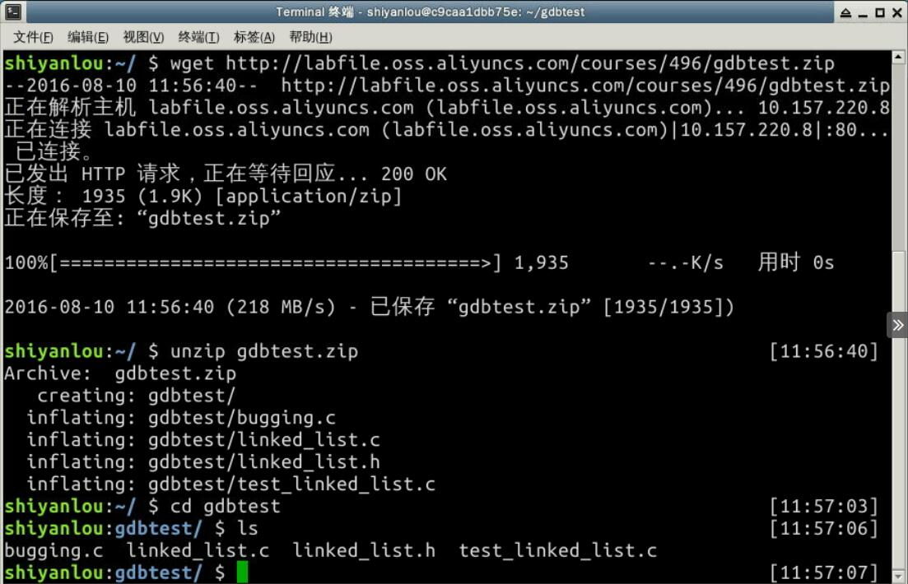

#### 一、课程简介

2022年5月15日18:04:14


#### 1.1 实验简介

本课程通过动手实验学习 Linux 上 GDB 调试 C 语言程序的基本技巧。首先讲解了 GDB 的常用命令，然后通过对有问题的链表程序的调试来逐步实践挖掘程序 BUG 的过程。

#### 1.2 实验知识点

- Linux 环境下 C 语言的程序调试过程
- GDB 调试程序的基本步骤
- 链表程序 BUG 调试实战

#### 1.3 实验环境

- Xfce 终端
- GCC
- Gedit

#### 1.4 适合人群

本课程适合有 C 语言基础，想做练手项目的同学，可以有效的学习 GDB 的进入和退出，设置断点，单步调试以及函数栈等调试功能，做一些有趣的事情。

#### 1.5 代码获取

你可以通过下面命令将本课程里的所有源代码下载到实验楼环境中，作为参照对比进行学习。

```bash
wget http://labfile.oss.aliyuncs.com/courses/496/gdbtest.zip
unzip gdbtest.zip
```

**请确认文件保存在目录：“/home/shiyanlou/gdbtest/” 下。**

---


#### 二、实验步骤


实验楼最核心的是动手实践学习技术，所以本课程中我们将通过对两个程序的调试来熟悉 GDB 调试技术。

这两个程序分别为：

> 1. `debugging.c` 程序：只有一个源文件，这是一个简单的求和程序，计算 `1+2+3+...+100` 的值。程序存在bug，导致预期结果并不为 5050，我们将在本节实验中调试并修复 BUG。
> 2. 链表程序：本例的程序来源于 [github](http://github.com/cs202/cs202-gdb-tutorial)，程序定义了数据结构链表，并使用了三个测试函数进行测试，程序仍然有 BUG，需要我们使用 GDB 去发现。

下载后的文件列表如下图所示：




---

