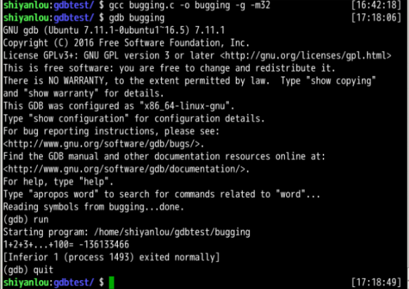
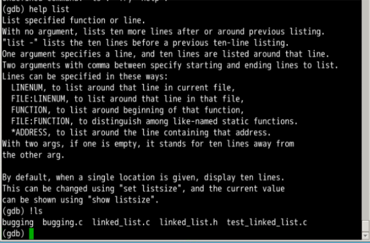

2.1 GDB 的基本介绍


GDB 基础知识：

> GDB, 是 `The GNU Project Debugger` 的缩写, 是 Linux 下功能全面的调试工具。GDB 支持断点、单步执行、打印变量、观察变量、查看寄存器、查看堆栈等调试手段。在 Linux 环境软件开发中，GDB 是主要的调试工具，用来调试 C 和 C++ 程序。

在终端输入以下命令安装 GDB：

```bash
sudo apt-get update
sudo apt-get install gdb
```

#### 2.1.1 GDB 的进入和退出

如果要调试程序，需要在 gcc 编译可执行程序时加上 `-g` 参数，首先我们编译 `bugging.c` 程序，生成可执行文件：

```bash
gcc bugging.c -o bugging -g -m32
```

其中 `-o` 指定输出文件名, 实验楼的环境是 64 位的操作系统，所以默认会编译为 64 位的程序，添加 -m32 选项可以编译为 32 位。

如果在你的环境里编译报错，请安装 libc6-dev-i386 后再次编译：

```bash
sudo apt-get install libc6-dev-i386
```

输入 `gdb bugging` 进入 gdb 调试 bugging 程序的界面：

```bash
gdb bugging
```

在 gdb 命令行界面，输入`run` 执行待调试程序：

```bash
(gdb) run
```

在 gdb 命令行界面，输入`quit` 退出 gdb：

```bash
(gdb) quit
```

上述步骤的操作截图如下：



#### 2.1.2 GDB 命令行界面使用技巧

命令补全：

> 任何时候都可以使用 `TAB` 进行补全，如果只有一个待选选项则直接补全；否则会列出可选选项，继续键入命令，同时结合 `TAB` 即可快速输入命令。

部分 gdb 常用命令一览表：

| 命令             | 简写形式  | 说明                         |
| ---------------- | --------- | ---------------------------- |
| list             | l         | 查看源码                     |
| backtrace        | bt、where | 打印函数栈信息               |
| next             | n         | 执行下一行                   |
| step             | s         | 一次执行一行，遇到函数会进入 |
| finish           |           | 运行到函数结束               |
| continue         | c         | 继续运行                     |
| break            | b         | 设置断点                     |
| info breakpoints |           | 显示断点信息                 |
| delete           | d         | 删除断点                     |
| print            | p         | 打印表达式的值               |
| run              | r         | 启动程序                     |
| until            | u         | 执行到指定行                 |
| info             | i         | 显示信息                     |
| help             | h         | 帮助信息                     |

查询用法：

> 在 gdb 命令行界面，输入 `help command` 可以查看命令的用法，command 是你想要查询的命令。

执行 Shell 命令：

> 在 gdb 命令行界面可以执行外部的 Shell 命令：
>
> ```bash
> (gdb) !shell 命令
> ```
>
> 例如查看当前目录的文件：
>
> 


下一步