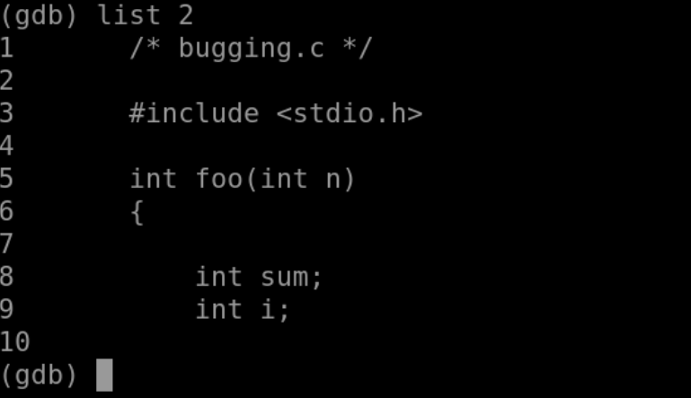
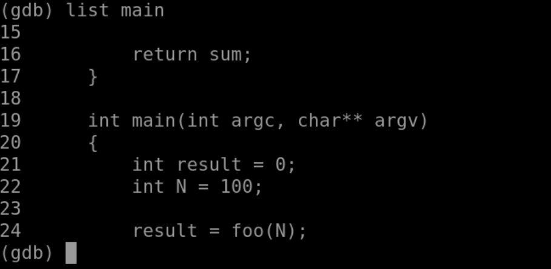

#### 2.2 GDB 查看源码

我们重新进入 debugging 调试界面：

*list* 命令用来显示源文件中的代码。

- list 行号，显示某一行附近的代码：
- list 文件名 : 行号，显示某一个文件某一行附近的代码，用于多个源文件的情况。

- list 函数名，显示某个函数附近的代码：
- list 文件名 : 函数名，显示某一个文件某个函数附近的代码，用于多个源文件的情况。

