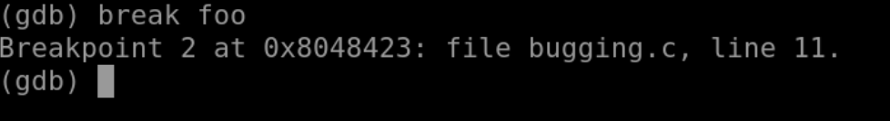

C2.3 GDB 断点

2022年5月15日18:21:25

---

常用命令

```
- `list`
- `info breakpoints`
- `break`
- `delete`
- `disable` 和 `enable`
- `enable once` 和 `enable delete`
- `next`, `step`, `finish`, `continue`, `until`
- `info locals` 和 `print`
```


#### 2.3.1 设置断点

*break* 命令用来设置断点。

- break 行号，断点设置在该行开始处，**注意：该行代码未被执行**：
- break 文件名 : 行号，适用于有多个源文件的情况。
- 
- break 函数名，断点设置在该函数的开始处，**断点所在行未被执行**：
- **break 文件名 : 函数名，适用于有多个源文件的情况。**

#### 2.3.2 查看断点信息

*info breakpoints* 命令用于显示当前断点信息。

其中每一项的信息：

> - Num 列代表断点编号，该编号可以作为 delete/enable/disable 等控制断点命令的参数
> - Type 列代表断点类型，一般为 breakpoint
> - Disp 列代表断点被命中后，该断点保留(keep)、删除(del)还是关闭(dis)
> - Enb 列代表该断点是 enable(y) 还是 disable(n)
> - Address 列代表该断点处虚拟内存的地址
> - What 列代表该断点在源文件中的信息

#### 2.3.3 删除断点

*delete* 命令用于删除断点。

- delete Num，删除指定断点，断点编号可通过 info breakpoints 获得：
- delete，不带任何参数，默认删除所有断点：

#### 2.3.4 关闭和启用断点

*disable* 命令和 *enable* 命令分别用于关闭和启用断点：

> *disable* 命令用于关闭断点，有些断点可能暂时不需要但又不想删除，便可以 disable 该断点。
>
> *enable* 命令用于启用断点。

- disable Num，关闭指定断点，断点编号可通过 info breakpoints 获得：
- disable，不带任何参数，默认关闭所有断点。
- enable Num，启用指定断点，断点编号可通过 info breakpoints 获得。
- enable，不带任何参数，默认启用所有断点。

**disable 和 enable 命令影响的是 info breakpoints 的 Enb 列，表示该断点是启用还是关闭**


---

2.4 关于断点的其他知识


#### 2.4.1 断点启用的更多方式

*enable* 命令还可以用来设置断点被执行的次数，比如当断点设在循环中的时候，某断点可能多次被命中。

- enable once Num，断点 hit 一次之后关闭该断点
- enable delete Num，断点 hit 一次之后删除该断点

**这两个命令影响的是 info breakpoints 的 Disp 列，表示该断点被命中之后的行为。**

#### 2.4.2 断点调试的一些命令

1. **打印变量**

调试的过程中需要观察变量或者表达式的值，所以先介绍两个基本的显示变量值的命令：

> - *info locals*
>
>   打印当前断点处所在函数的所有局部变量的值，不包括函数参数。
>
> - *print 变量或表达式*
>
>   打印表达式的值，可显示当前函数的变量的值、全局变量的值等
>
>   `print/FMT` 可以控制打印的格式，常见的有x(十六进制)、t(二进制)、c(显示为字符)等。

1. **启动程序**

*run* 命令用于启动待调试程序，并运行到断点处停下。

> - run
>
>   不带任何参数，启动待调试程序，不传递参数。
>
> - run 参数
>
>   有些程序需要跟参数，直接带上参数列表即可，会传递给 main 函数的 argc、argv 变量。

1. **单步命令**

*next, step, finish, continue, until* 用于控制整个调试过程中，程序执行的流程。

> - next
>
>   > next 单步执行，函数调用当做一条指令，不会进入被调用函数内部
>   >
>   > next N，表示单步执行N次
>
> - step
>
>   > step 单步执行，会进入到函数调用内部
>   >
>   > step N，表示单步执行N次
>
> - finish
>
>   执行程序到当前函数结束
>
> - continue
>
>   执行程序到下个断点
>
> - until
>
>   until N，执行程序到源代码的某一行

下图是windows下图形IDE c-free的调试菜单，在 Linux 上 gdb 命令虽然没有图形化的显示，但如果理解了 gdb 的单步调试，这些选项应该可以很容易理解和使用：


#### 2.4.3 断点小结

断点是调试最基本的方法之一，这一节主要介绍了断点相关的知识。主要是几个断点相关的命令。

> - `list`
> - `info breakpoints`
> - `break`
> - `delete`
> - `disable` 和 `enable`
> - `enable once` 和 `enable delete`
> - `next`, `step`, `finish`, `continue`, `until`
> - `info locals` 和 `print`

不熟悉命令的时候，记得在 gdb 命令行下键入 `help info breakpoints` 等命令，查询帮助文档。