 GDB 单步调试


#### 2.5.1 断点设置

本节将继续使用 bugging 程序，首先确认已生成了 debug 的可执行文件。在 `main` 函数处设置了一个断点，用于进行后续的单步调试。

```
gdb bugging
(gdb) break main
(gdb) info breakpoints
```

#### 2.5.2 正式开始调试程序

bugging 程序简介：

> - bugging 示例程序是用来计算 1+2+3+...+100 的值的，预期结果为高斯数 5050
> - 程序运行的结果和我们预期的不一致，仅仅从代码不易看出 bug 所在
> - 接下来使用 gdb 单步调试该程序，找到 bug 所在

调试 bugging：

- `info breakpoints` 查看我们设置的断点：

  > 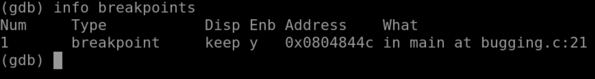
  >
  > 在main处设置了一个断点，位于源文件 bugging.c 的 21 行

- `run` 运行程序，程序在第一次运行到断点会停止，等待下一条命令：

  > 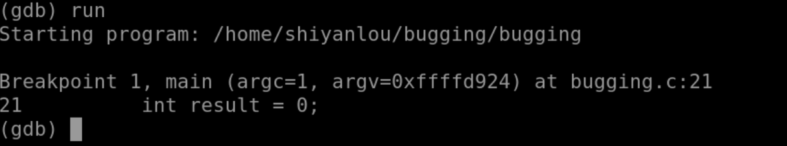
  >
  > 启动bugging程序，停在断点处，位main函数的第一条指令处

- `next` 单步执行：

  > 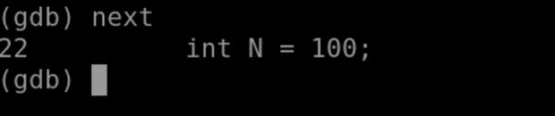
  >
  > 单步执行，相当于执行了 result 变量的初始化

- `next`：

  > 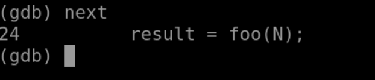
  >
  > 单步执行，相当于执行了 N 变量的初始化

- `step` ，也是单步执行，和 `next` 的区别还记得吗：

  > 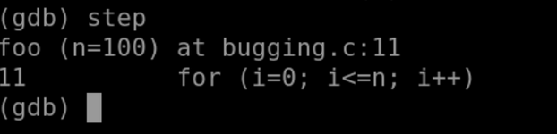
  >
  > 单步进入，进入foo函数，停在foo函数的第一条指令处

- `list` 查看当前行附近的代码：

  > 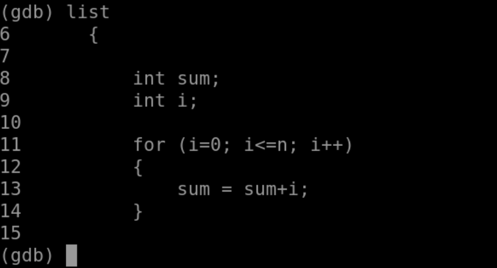
  >
  > 查看下 foo 函数的源码

- `info locals` 打印出所有的局部变量：

  > 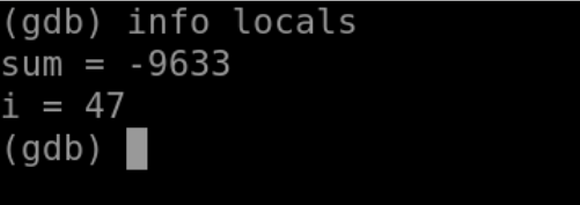
  >
  > 打印下 foo 函数的所有局部变量，可以看到这些值是无规律的，因为没有初始化

- `next` ：

  > 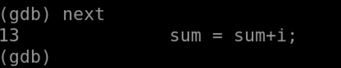
  >
  > 单步执行，进入循环体

- `next` ：

  > 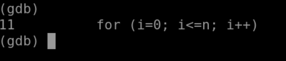
  >
  > 单步执行，sum = sum + i; 程序继续执行到 for 语句的判断处

- `info locals`：

  > 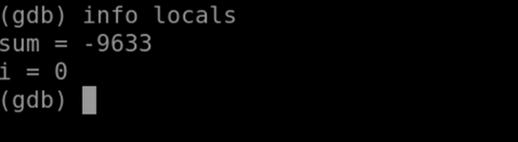
  >
  > 再次查看变量，i 的值符合预期，sum 的值依然不合理

- `list foo` 查看下 foo 函数的源码：

  > 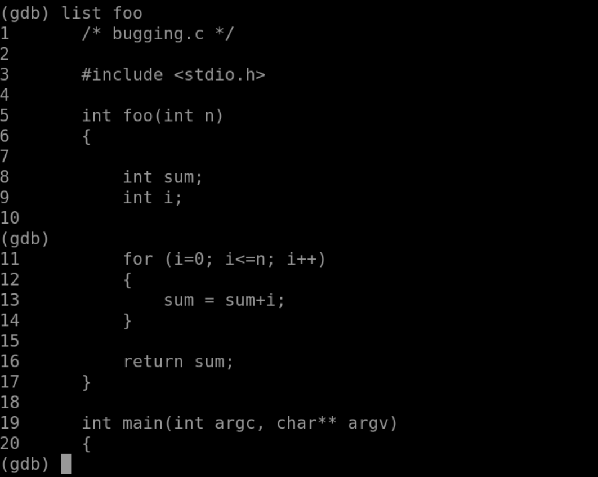
  >
  > 检查 foo 函数的代码，很容易发现定义了两个变量 sum 和 i，i 在循环体被初始化。而 sum 未被初始化。

到这里已经基本定位程序 bug 所在了，sum 的值从进入循环体到执行一次循环结束都不对。bug 根源就是 sum 变量未初始化，导致错误的累加。我们修改 `int sum = 0;` 重新构建程序，便可以得到预期结果。

