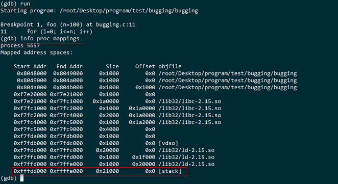
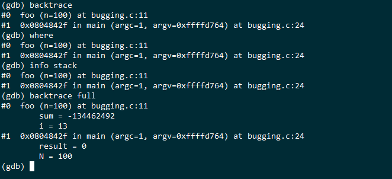
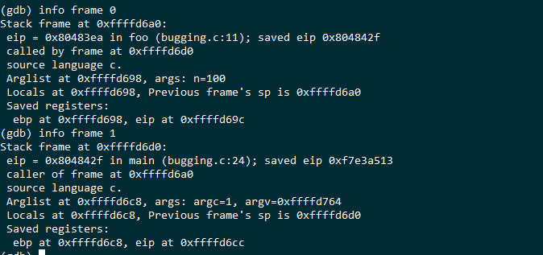

#### GDB 函数栈

2022年5月15日19:30:16

---

#### 2.7.1 断点设置

本节将继续使用 bugging 程序，首先确认之前有执行过以下命令在 main 函数处设置了一个断点，用于进行后续的单步调试。

```bash
gdb bugging
> (gdb) break foo
> (gdb) info breakpoints
```

在 foo 函数处设置了一个断点。

#### 2.7.2 函数与函数栈

进程在内存空间会拥有一块叫做 stack 的区域，函数内部的局部变量、函数之间调用时参数的传递和返回值等等都会用到栈这种数据结构。

- *info proc mappings* 可以查看待调试进程的内存分布情况

  ```bash
  run
  info proc mappings
  ```

  运行的截图如下  从进程的地址空间分配情况可以看到，有一块区域 [stack]，这就是该进程的 栈空间

- *backtrace* 查看函数调用栈的情况

  > backtrace、where、info stack
  >
  > 这三个命令都可以查看函数的调用情况

  > backtrace full、where full、info stack full
  >
  > 这三个命令查看函数调用情况的同时，打印所有局部变量的值

  

  - 栈帧(stack frame)

    > \#1 是 main 函数用到的栈空间，这一部分可以称之为 main 函数的 stack frame
    >
    > \#0 是 foo 函数用到的栈空间，同样可称之为 foo 函数的 stack frame，0 代表当前执行停在 foo 函数内
    >
    > 可以得到函数调用关系为，main 调用 foo

  - *info frame Num* 查看某个函数栈帧的详细信息

    

本节并不详细介绍 函数与函数栈的理论知识，但是通过回溯栈，可以调试函数之间的调用关系、局部变量值的变化等。所以还是需要理解一些基本概念，可以看一下这篇文章：[函数调用过程中栈是怎么压入和弹出的？](https://www.zhihu.com/question/22444939)


