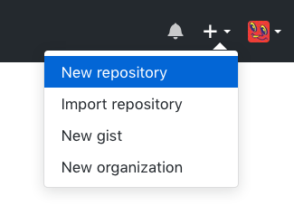
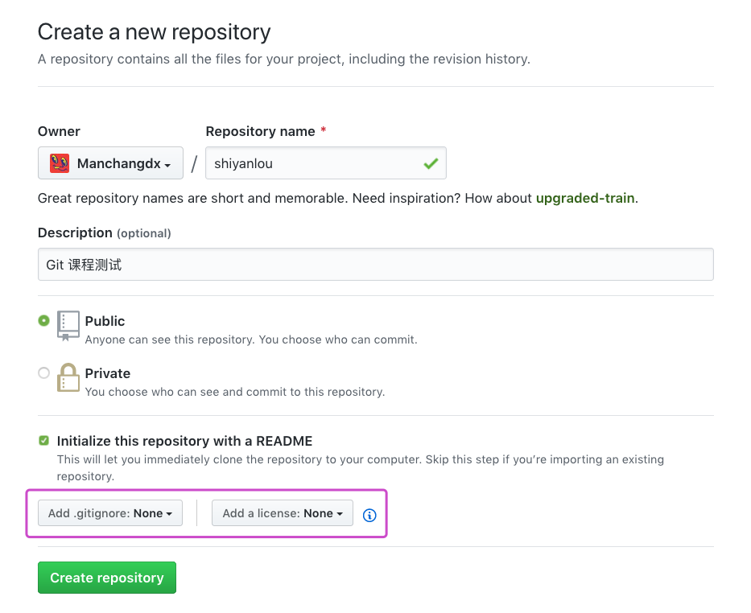
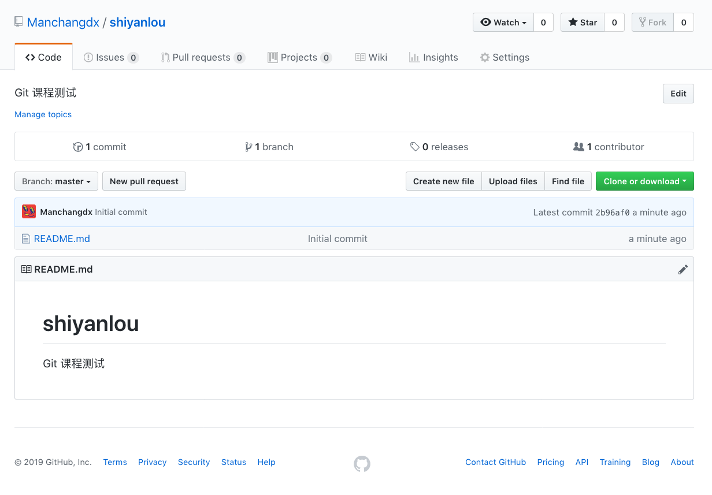

#### 二、在 GitHub 上创建仓库

首先，打开 [GitHub](https://github.com/) 注册个人账户并登录。登录后，在个人主页的右上角点击 `New repository` 创建新的仓库：

打开页面如下图所示，填入相关信息。注意下图紫色框中有两个下拉按钮，左边的用来选择忽略文件，右边的用来选择所属协议，这两项可以不选，后面的课程会讲到。

点击绿色按钮创建新的仓库，成功后自动跳转到新建仓库的主页面，如下图所示：

