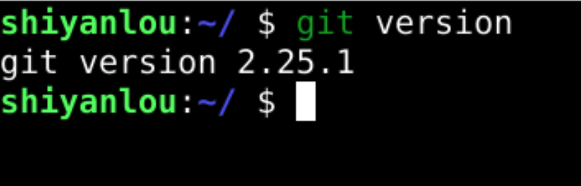
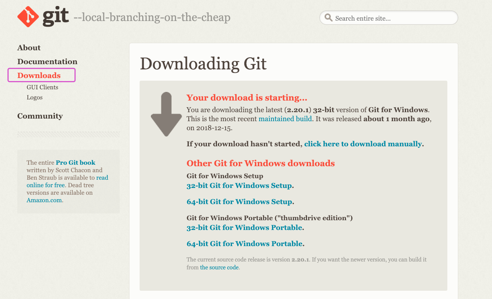

#### 三、安装 Git  😀 `git version`

2022年3月26日16:46:44

接下来，我们就要尝试使用这个仓库。

首先，打开实验环境。实验环境中内置了 Git 版本控制器，无需自己安装。打开终端使用 `git version` 命令查看版本：

**注意：随着实验环境的升级 git 的版本可能会有变化，不过本课程所讲的功能在各个版本的使用中差别不大。*

在 Windows 系统中可以安装 [Git for Windows 客户端](https://git-scm.com/download/win) ：

> 如遇网络问题无法下载可以访问 [华为云镜像站](https://mirrors.huaweicloud.com/home) 下载。

