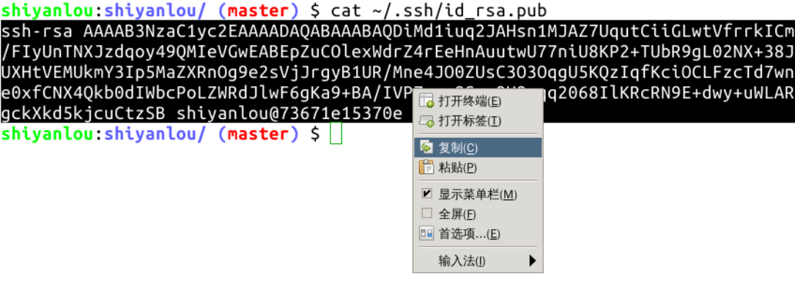

#### 添加 SSH 关联授权 😣😣😣

2022年3月26日16:48:18

---

**在 2021 年 8 月 GitHub 更新后，已经不再允许使用账户密码操作 GitHub，必须使用 SSH 密钥登陆。所以我们可以在系统中创建 SSH 公私钥，并将公钥放到 GitHub 指定位置。如此操作即可生成 GitHub 账户对于当前系统中的 Git 授权。**

终端执行 `ssh-keygen` 命令按几次回车生成公私钥，公私钥存放在主目录下的隐藏目录 `.ssh` 中的两个文件中：

将 `~/.ssh/id_rsa.pub` 文件中的公钥内容复制出来，实验环境中可以使用右侧工具栏中的剪切板复制：

然后在 GitHub 网页上添加公钥：

Title 自定义，把剪切板中的内容粘贴到 Key 中，点击绿色按钮添加 SSH Key 即可：

使用 SSH 的好处主要有两点：

- 免密码推送，执行 `git push` 时不再需要输入用户名和密码了；
- 提高数据传输速度。它不是必须的，比如在课程中挑战环境是不可保存的，一次性的，这种环境就没有必要创建 SSH 了，因为相较好处来说，还是太麻烦了。

