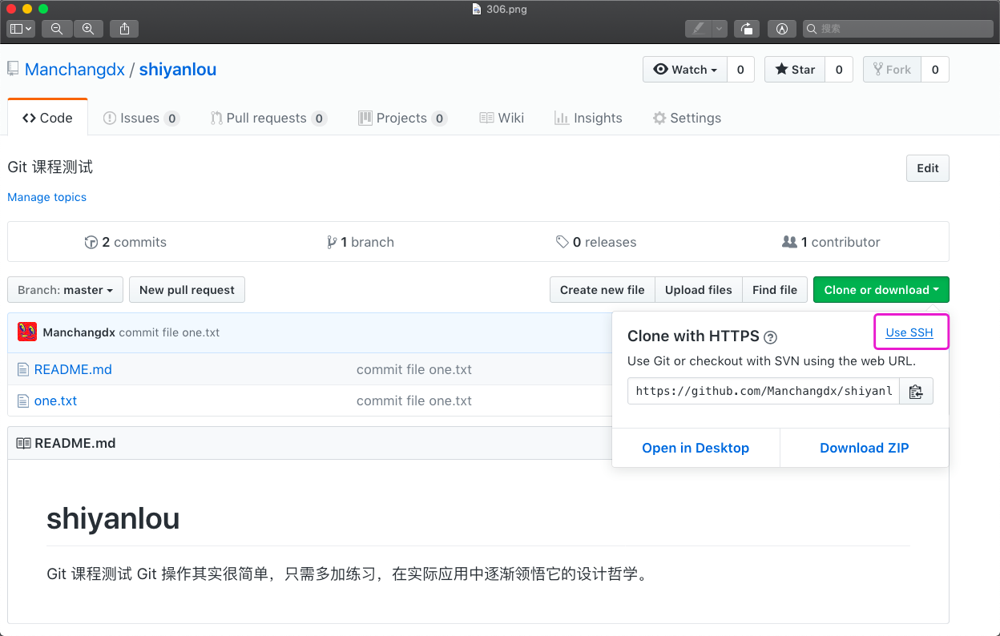
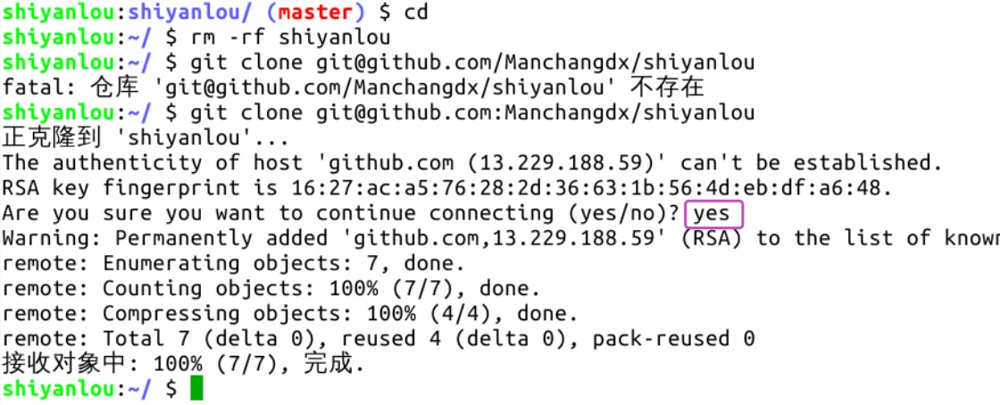
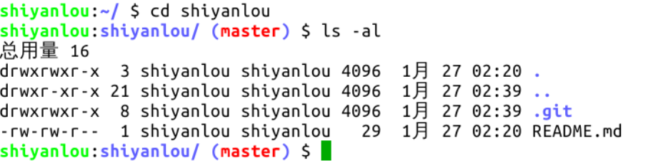
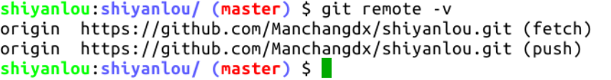
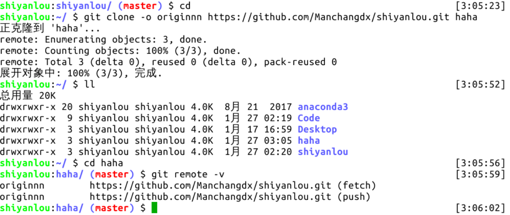
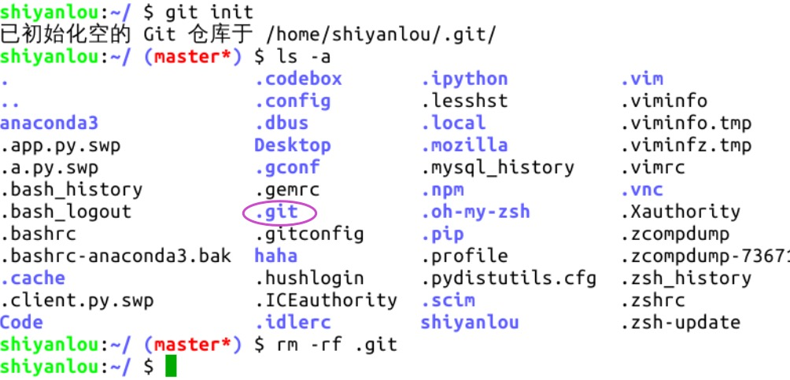

#### 克隆 GitHub 上的仓库到本地 😉😉

2022年3月26日16:54:48 Ptliu

---

现在克隆前面我们在 GitHub 上创建的仓库，使用 `git clone + [仓库地址]` 命令即可，这是标准的克隆仓库命令。

回到仓库主目录，点击下图所示的绿色按钮，点击紫色框中的 “Use SSH”，然后复制这个链接。

**重要的一点：只有使用这种 git 开头的地址克隆仓库，SSH 关联才会起作用。**

在实验环境里删除原仓库，使用此链接重新克隆仓库。克隆仓库是需要确认连接，输入 yes 即可：

进入仓库主目录，如下图所示，仓库主目录中有个 `.git` 隐藏目录，它里面包含了仓库的全部信息，删掉这个目录，仓库就变成普通的目录了。进入到仓库目录中，命令行前缀发生了一些变化，出现了红色的 master ，它就是当前所在的分支名：

当我们在 GitHub 上创建一个仓库时，同时生成了仓库的默认主机名 origin，并创建了默认分支 master。GitHub 可以看成是免费的 Git 服务器，在 GitHub 上创建仓库，会自动生成一个仓库地址，主机就是指代这个仓库，主机名就等于这个仓库地址。克隆一个 GitHub 仓库（也叫远程仓库）到本地，本地仓库则会自动关联到这个远程仓库，执行 `git remote -v` 命令可以查看本地仓库所关联的远程仓库信息：

Git 要求对本地仓库关联的每个远程主机都必须指定一个主机名（默认为 origin），用于本地仓库识别自己关联的主机，`git remote` 命令就用于管理本地仓库所关联的主机，一个本地仓库可以关联任意多个主机（即远程仓库）。

克隆远程仓库到本地时，还可以使用 `-o` 选项修改主机名，在地址后面加上一个字段作为本地仓库的主目录名，举例如下：

另一个在其它 Git 教程中常见的命令 `git init` ，它会把当前所在目录变成一个本地仓库，因为有 GitHub 的存在，这个命令在我们的生产生活中用到的次数应该是零，除非你想费时费力自己搭建服务器。操作截图如下：

