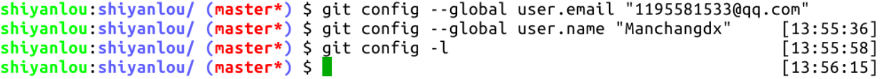
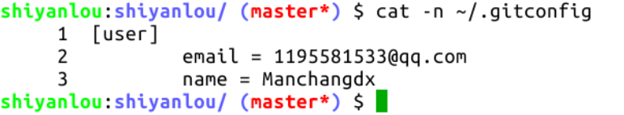

#### 对 Git 进行一些本地配置(用户名,邮箱)：😣😣

- `user.email`：写入你自己注册 GitHub 账号的邮箱
- `user.name`：你自己的 GitHub 账号名字

这两个命令设置你的身份信息如下图。`git config -l` 可以查看配置信息（就不展示截图了）：

完成后，系统自动生成 Git 的配置文件，就是主目录中的隐藏文件 `.gitconfig` ：

上图所示的配置文件也是可以直接手动修改