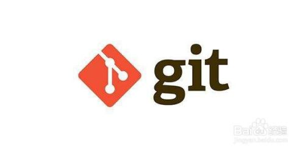
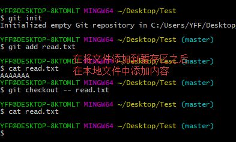
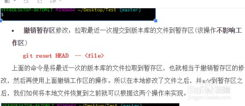
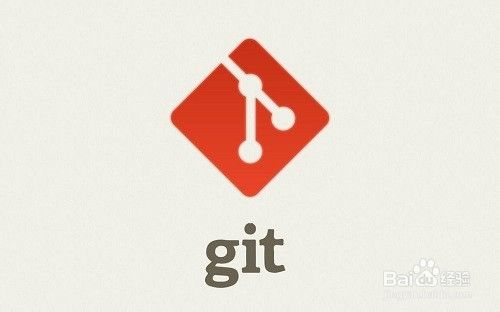
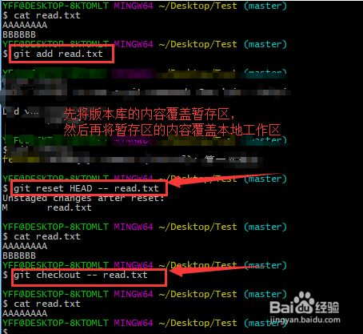

## 一、撤销本地修改（修改未add到暂存区）

1. 

   首先，说一下**撤销工作区的修改**的本质就是**拉取暂存区文件**替换**工作区文件**。

   使用的命令为：**git checkout -- <file>**

   

2. 

   然后下面的详细步骤为如下：

   1.先创建了版本库。

   2.将文件read.txt加入暂存区。

   3.然后修改read.txt文件内容。

   4.使用命令git checkout -- read.txt。

   5.第三步的修改就被撤销了。

   

   END

## 二、撤销暂存区的修改（暂存区未commit）

1. 

   撤销暂存区的修改的本质就是**拉取版本库**的文件到**暂存区**中。

   使用的命令：**git reset HEAD  -- <file>**

   

   END

## 三、撤销本地修改（修改已add到暂存区）

1. 

   这里对应的情景就是在本地修改了，且将本地修改使用git add 命令添加到暂存区。如何撤销这种修改呢？撤销的方法就是将前面的两个命令连起来一起用。

   1.将暂存区的修改撤销

   **git reset HEAD  -- <file>**

   2.将本地工作区的修改撤销

   **git checkout --	 <file>**

   

2. 

   下面就是实际操作的过程。

   1.将本地的修改add到了暂存区

   2.使用**git reset HEAD  -- <file>**命令撤销暂存区的修改。

   3.使用**git checkout -- <file>**命令撤销本地工作	区的修改。

   

   