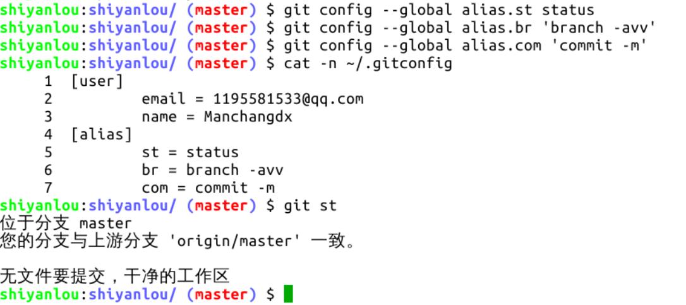

#### 为 Git 命令设置别名

2022年3月27日18:44:23

---

上一节课程中的操作，有些命令的重复度极高，比如 `git status` 和 `git branch -avv` 等，Git 可以对这些命令设置别名，以便简化对它们的使用，设置别名的命令是 `git config --global alias.[别名] [原命令]`，如果原命令中有选项，需要加引号。别名是自定义的，可以随意命名，设置后，原命令和别名具有同等作用。操作如下：

自己设置的别名要记住，也可以使用 `git config -l` 命令查看配置文件。下面文档中的命令将使用这些别名。