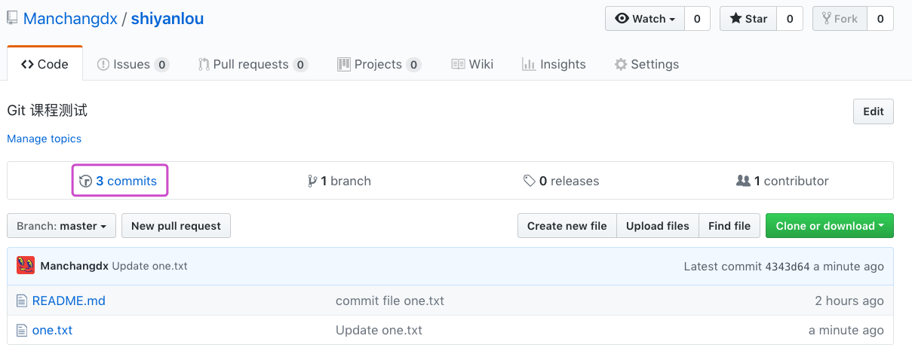
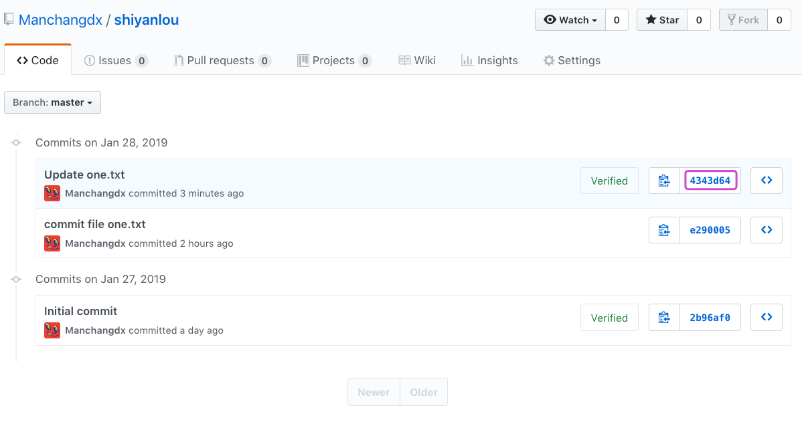
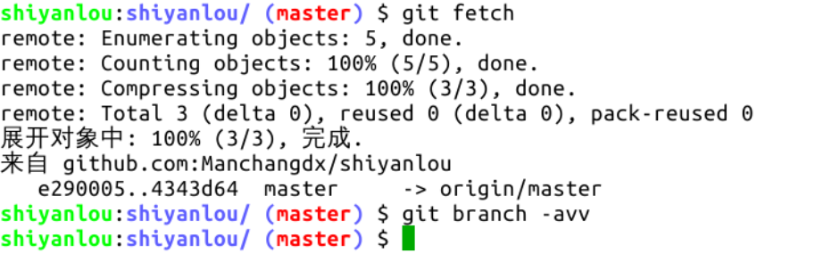
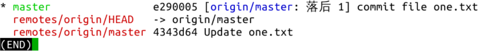
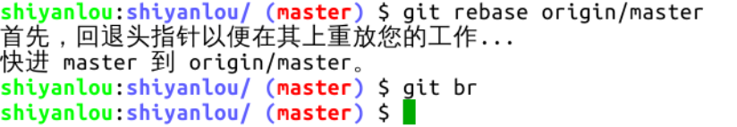
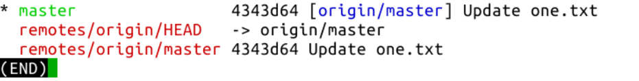

#### git fetch 刷新本地分支信息   🤔🤔🤔

2022年3月27日18:53:07

---

在介绍分支前，先讲解另一个命令 ** **

举例说明一下，首先我们在 GitHub 页面上对 one.txt 文件进行修改并增加一次提交。

提交完成后，提交数变成 3 个，点下图紫色框中的链接可以看到提交记录：

在实验环境中执行 `git fetch` 命令，然后执行 `git branch -avv` 查看分支信息：

可以看到，本地分支 master 的版本号无变化，而远程分支已经更新。所以，`fetch` 命令的作用是刷新保存在本地仓库的远程分支信息，此命令需要联网。此时若想使本地 master 分支的提交版本为最新，可以执行 `git pull` 命令来拉取远程分支到本地，`pull` 是拉取远程仓库的数据到本地，需要联网，而**由于前面执行过 `git fetch` 命令，所以也可以执行 `git rebase origin/master`(=git pull) 命令来实现 “使本地 master 分支基于远程仓库的 master 分支”**，`rebase` 命令在后面还会经常用到，这里只需按部就班操作即可：

可以看到，远程仓库 master 分支、本地仓库的 origin/master 分支、本地仓库的 master 分支已经一致。