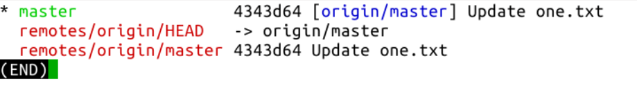
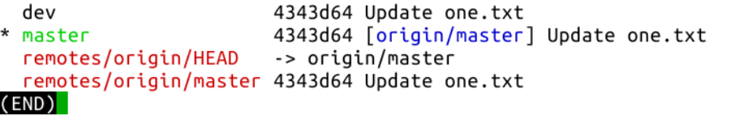
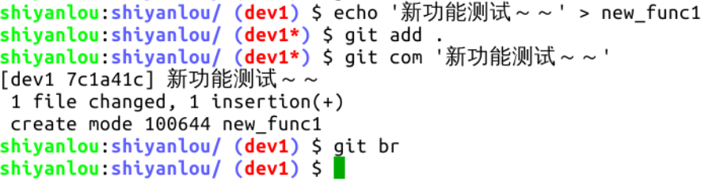

#### 创建新的本地分支   😛😛

2022年3月27日19:33:11

---

分支在项目开发中作用重大，多人协作时尤其不可或缺。例如一个项目上线了 1.0 版本，研发部门需要开发 1.1、1.2 两个测试版，增加不同的新功能，测试版的代码显然不能在正式版所在的分支上，此时需要新的分支来存放不同版次的代码。再例如实验楼的课程团队在维护课程仓库时，每个人都有各自的分支，在自己的分支上进行修改，然后向 master 分支提 PR（pull request），最后从 master 分支推送到线上。

首先，克隆远程仓库到本地，进入仓库主目录，执行 `git br` 查看分支信息：

执行 `git branch [分支名]` 可以创建新的分支：

此命令创建新分支后并未切换到新分支，还是在 master 分支上，执行 `git checkout [分支名]` 切换分支，`checkout` 也是常用命令，先给它设置别名，然后切换分支：

创建新分支还要手动切换太麻烦，介绍另一个常用的命令 `git checkout -b [分支名]` 创建分支并切换到新分支：

如上图所示的分支信息，前两行是新建的本地分支信息，它们的版本号与主分支 master 一致，这是因为在哪个分支上创建新分支，新分支的提交记录就与哪个分支一致。**新建分支并没有跟踪任何远程分支，所以没有 master 分支中的中括号和括号内的蓝色远程分支名。**

假设我们要在当前分支 dev1 上开发一个新的功能，需要增加一个文件 new_func1，然后生成一个新的提交：

