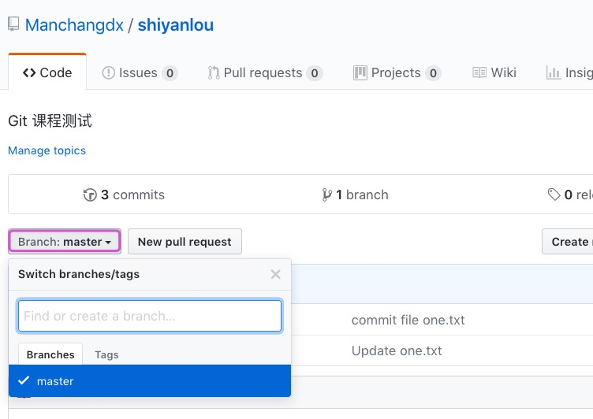
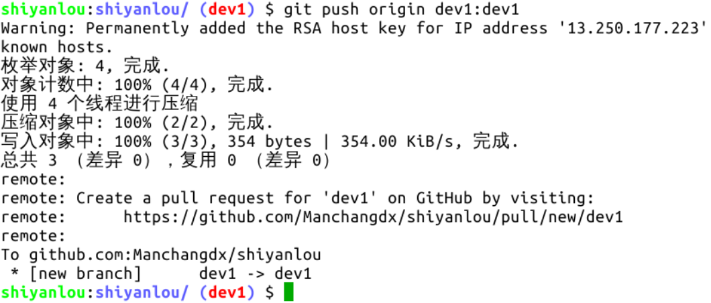
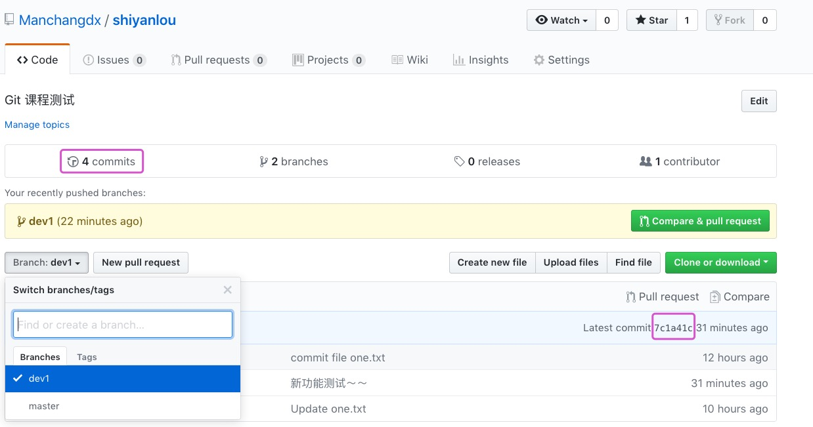

#### 将新分支中的提交推送至远程仓库  `git push [主机名] [本地分支名]:[远程分支名]`😀😀😀

2022年3月27日19:42:12

---

好，新功能已经写好并提交到了版本区，现在要推送了，推送到哪里呢？正常逻辑当然要推送到远程仓库的同名分支，不过现在远程仓库里只有一个分支：

上图紫色框中是一个下拉按钮，点击后显示仓库中的全部分支，按钮上显示的是当前所在分支。

执行 **`git push [主机名] [本地分支名]:[远程分支名]` 即可将本地分支推送到远程仓库的分支中，**通常冒号前后的分支名是相同的，如果是相同的，可以省略 `:[远程分支名]`，如果远程分支不存在，会自动创建：

上图命令可以简写为 `git push origin dev1` 。注意哦，这是我们创建 SSH 关联后第一次执行 `push` 命令，可以看到传输速度有明显的提高，更重要的是，不再需要重复输入用户名和密码了，另外打印信息的第一行是警告信息，因为是这个分支的第一次推送嘛，下次执行推送就不会再出现了。现在执行 `git br` 查看一下分支情况：

可以看到，远程分支 origin/dev1 的信息已经在本地存在，且与本地同名分支一致。再看下 GitHub 页面的情况：

很好，与预期毫无二致。