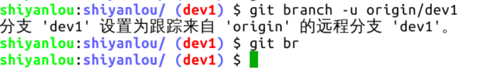
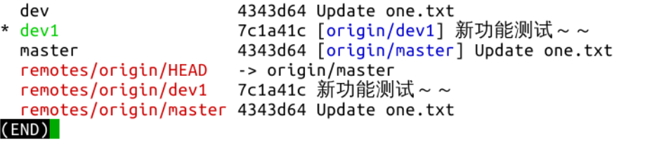
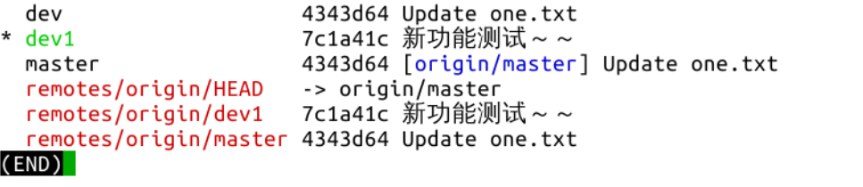
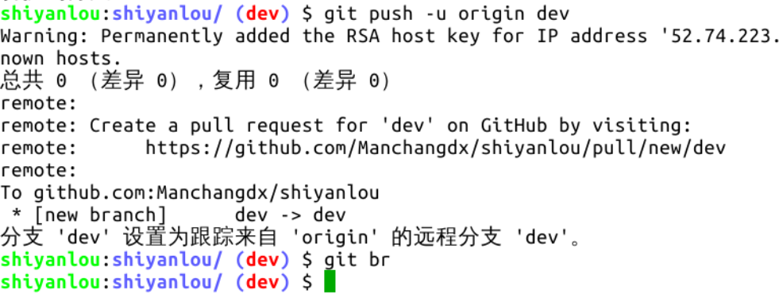
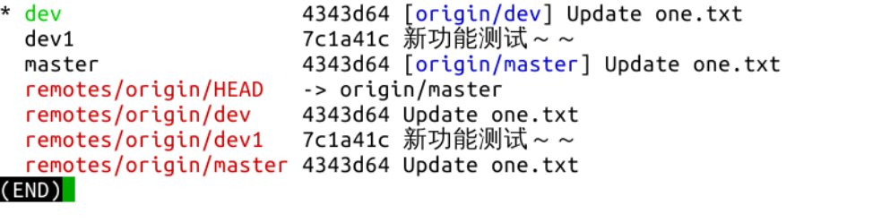

#### 本地分支跟踪远程分支 `branch -u [主机名/远程分支名] [本地分支名]`   😀😀

2022年3月28日15:25:41

----

现在有个问题，当我们再次在 dev1 分支上修改并提交，推送到远程仓库时还是要输入上面的那个长长的命令，好不方便。如果能和 master 分支一样跟踪远程同名分支，就可以直接使用 `git push` 命令推送了。有办法的，执行这个命令 `git branch -u [主机名/远程分支名] [本地分支名]` 将本地分支与远程分支关联，或者说使本地分支跟踪远程分支。如果是设置当前所在分支跟踪远程分支，最后一个参数本地分支名可以省略不写：

这个命令的 `-u` 选项是 `--set-upstream` 的缩写。可不可以让本地分支跟踪远程非同名分支呢？可以的，尽管几乎遇不到这种自找麻烦的需求。可不可以撤销本地分支对远程分支的跟踪呢？也是可以的，执行 `git branch --unset-upstream [分支名]` 即可撤销该分支对远程分支的跟踪，同样地，如果撤销当前所在的分支的跟踪，分支名可以省略不写：

问题又来了，前面的操作是先将本地分支推送到远程仓库，使远程仓库创建新分支，然后再执行命令使本地分支跟踪远程分支，有没有办法在推送时就自动跟踪远程分支呢？有的，在推送的时候，加个 `--set-upstream` 或其简写 `-u` 选项即可，现在切换到 dev 分支试一下这个命令：

下一步