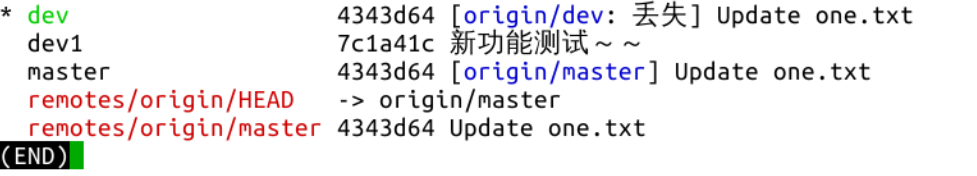

#### 删除远程分支  `git push [主机名] :[远程分支名] :[远程分支名] :[远程分支名]`  `git push [主机名] --delete [远程分支名]`😣😣😣

2022年3月28日15:39:34

---

接下来，介绍一下删除分支的方法。

首先，删除远程分支，使用 `git push [主机名] :[远程分支名]` ，如果一次性删除多个，可以这样：`git push [主机名] :[远程分支名] :[远程分支名] :[远程分支名]` 。此命令的原理是将空分支推送到远程分支，结果自然就是远程分支被删除。另一个删除远程分支的命令：`git push [主机名] --delete [远程分支名]`。删除远程分支的命令可以在任意本地分支中执行。两个命令分别试一下：

可以看到本地仓库已经没有远程分支 dev 和 dev1 的分支信息。查看 GitHub 仓库页面：

也只剩 master 一个分支。操作成功。

