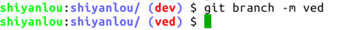
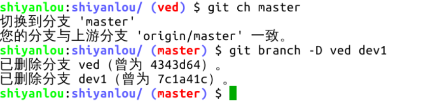
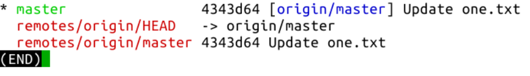

#### 本地分支的更名与删除  😛😛😛

2022年3月28日15:52:14

---

回到实验环境，使用 `git branch -D [分支名]` 删除本地分支，同样地，此命令也可以一次删除多个，将需要删除的分支名罗列在命令后面即可。在此之前，先介绍一个极少用到的命令：给本地分支改名 `git branch -m [原分支名] [新分支名]` ，若修改当前所在分支的名字，原分支名可以省略不写：

好，现在要一次性删除本地分支 ved 和 dev1。需要注意的一点：当前所在的分支不能被删除。切换到 master 分支，然后执行 `git branch -D ved dev1` 命令：

执行 `git branch -avv` 查看当前仓库分支状态：

很好，一切都回到了课程开始时的样子，就像什么都没有发生。本节课程就到这里。

下一步