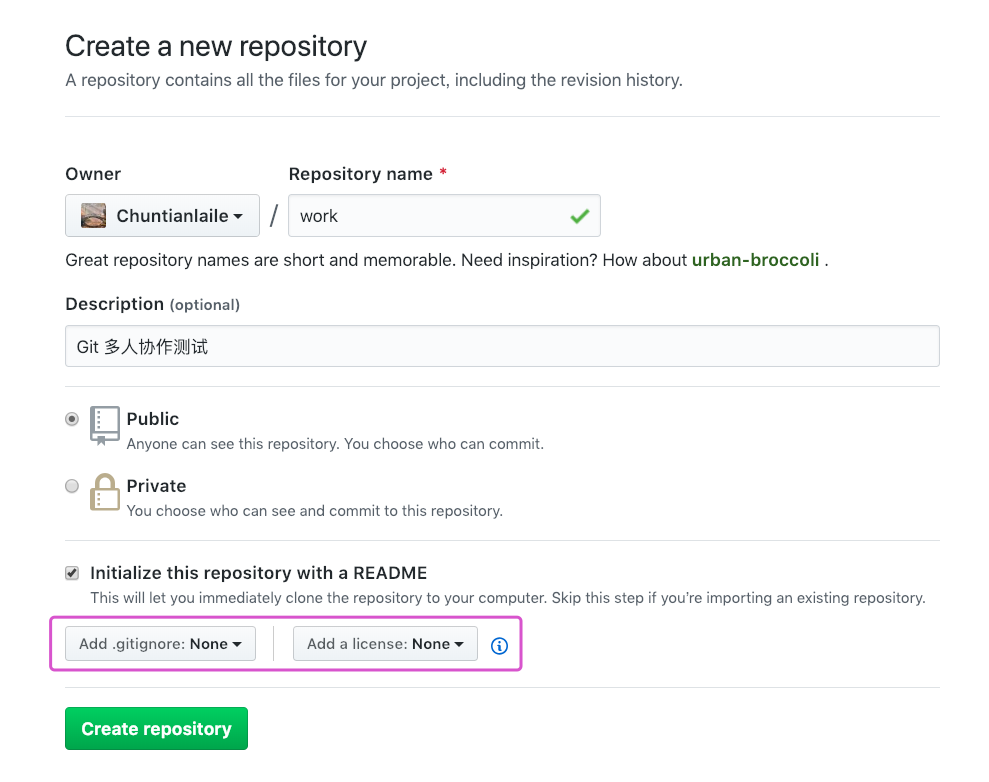
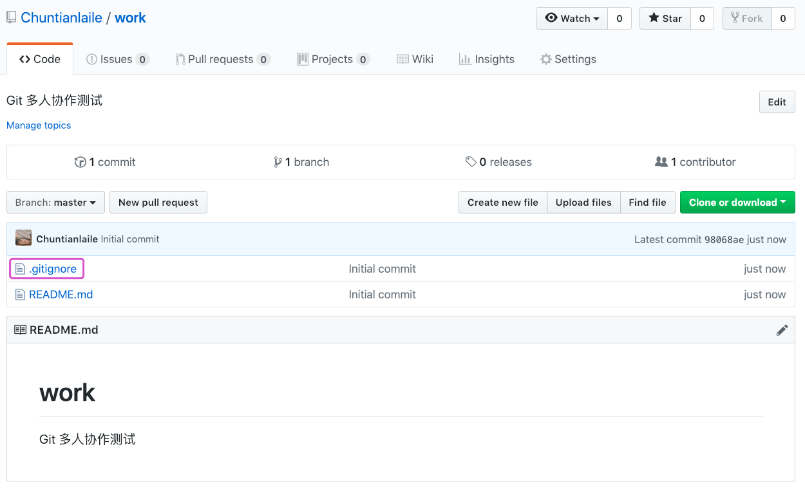

#### 二、创建仓库  😣😣😣

2022年3月28日16:03:48

---

首先，在组长账号中创建一个仓库，名为 work，在创建仓库时，需要说明第一节中提到的两个下拉框：

左边的忽略文件下拉框：我们在写代码时，总会出现一些不需要上传到仓库的垃圾文件、缓存文件、备份文件、环境文件等等，可以创建一个忽略文件将这些不需要被上传到远程仓库的文件忽略掉。忽略文件的名字是 `.gitignore`，它被放置在仓库主目录下，将不需上传的文件的名字写入其中，Git 就会自动忽略它们。比如这个仓库是用来 Windows 开发的，就在下拉框中选择 Windows，如果这是一个保存 Java 项目的仓库，就选择 Java。这样，在仓库创建成功后，忽略文件就自动出现了，这个忽略文件中有对应的语言或工具中绝大部分通用的忽略规则。当然了，你也可以自己手动增删改。

如果在创建仓库时忘记了选择忽略文件，几个提交后突然想起来，怎么办？GitHub 上有人把忽略文件都做好了，打开链接 [github / gitignore](https://github.com/github/gitignore) ，这个仓库里有很多忽略文件，选择你需要的放到自己的仓库即可。

右边的开源许可下拉框：关于开源许可证，不属于本课程所述范围，如有需要大家可以自行搜索。我们的仓库不需要选择这一项。选择这个之后，仓库中会出现相对应的图标，比如上面提到的忽略文件仓库：

在组长账号中创建好新仓库，如下图：

对上图右上角三个按钮进行说明：

Watch：这是一个下拉按钮，可以选择对此仓库关注、不关注、忽略等。

Star：如果觉得这个仓库很好，就点击这个按钮送一颗星，在淘宝提供刷星业务之前，仓库获得的星越多表示该项目越优秀。

Fork：在别人的仓库中点此按钮会克隆一个完全一样的仓库到你自己的账号中，包括所有分支、提交等，但不会克隆 issue（本节后面会讲到），当此仓库发生版本变化，不会自动同步到你克隆的仓库里，反之亦然。