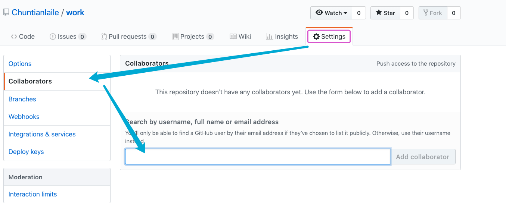
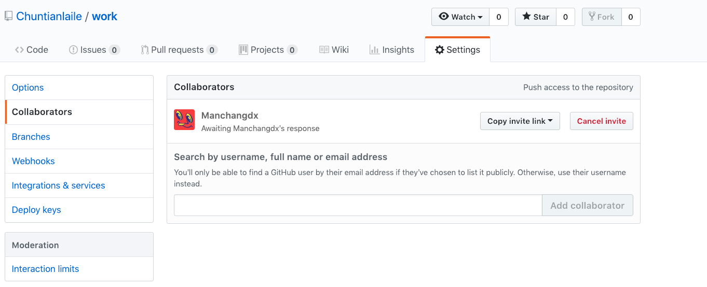
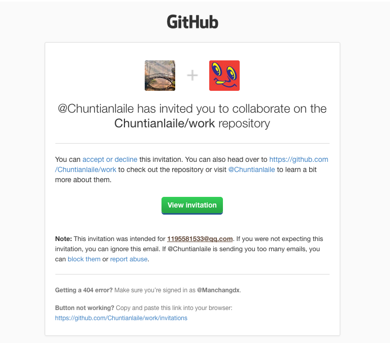
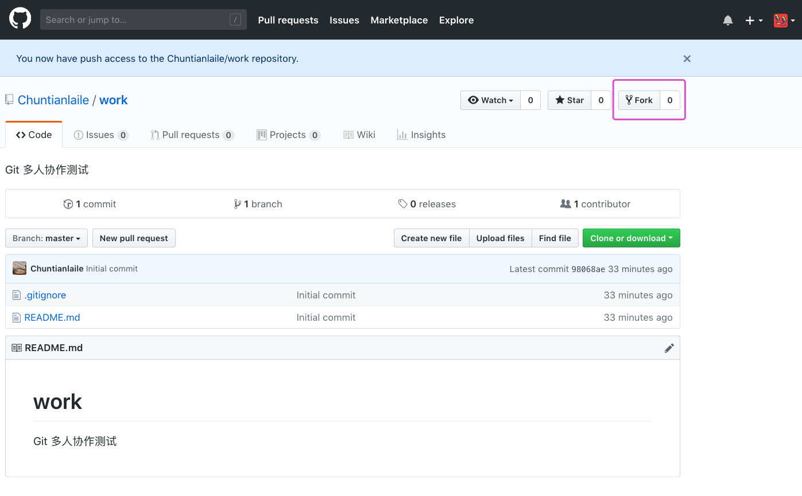
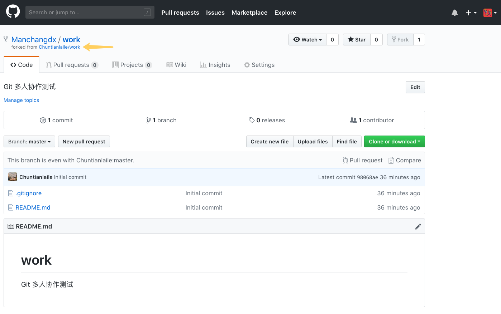

#### 三、增加合作者  😛😛

2022年3月28日17:16:42

---

现在在组长账号中增加该仓库的合作者，也就是组员：

在浅蓝色输入框中写入组员 GitHub 账号的用户名，选择正确的用户，点击右侧按钮就会发送一封邀请邮件给组员：

现在使用另一个浏览器登录组员的 GitHub 账号和邮箱，打开邮件：

点击上图绿色按钮，跳转到下图：

再次点击绿色按钮接受邀请，会跳转到组员访问组长仓库的页面：

点击上图紫色框中的 Fork 按钮，克隆组长的仓库到组员的账号中，完成后自动跳转到下图页面，也就是组员的仓库页面：

下一步