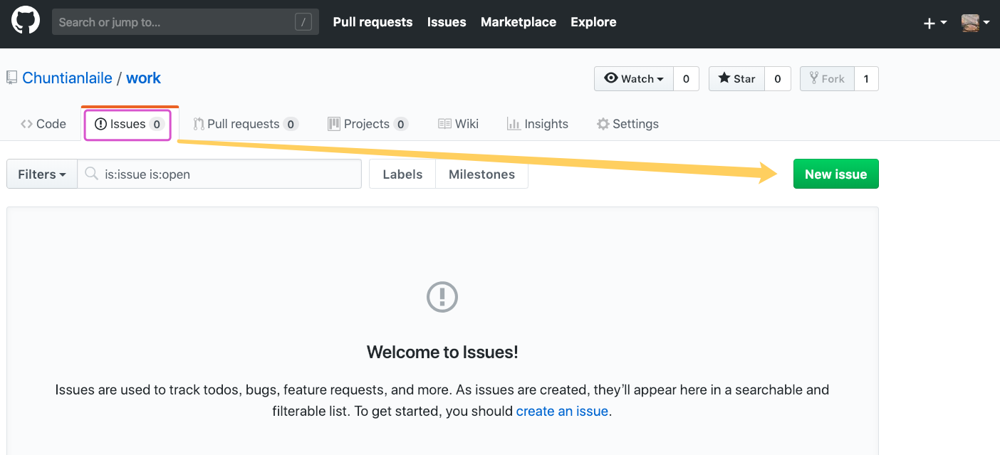
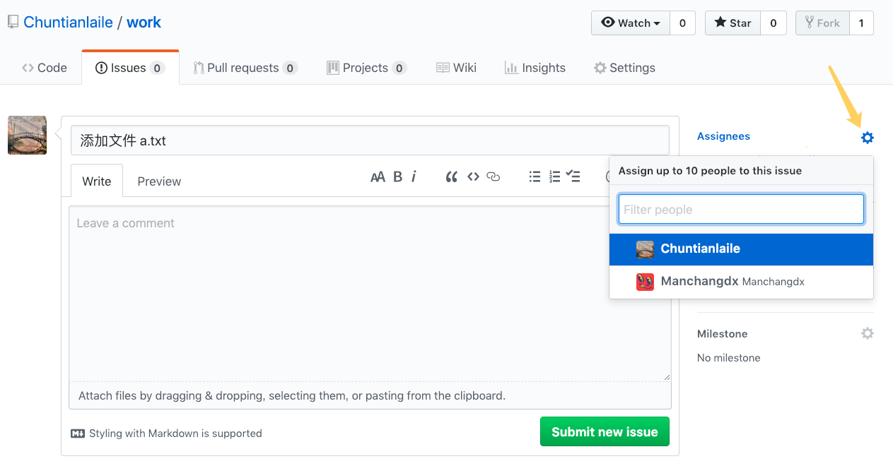
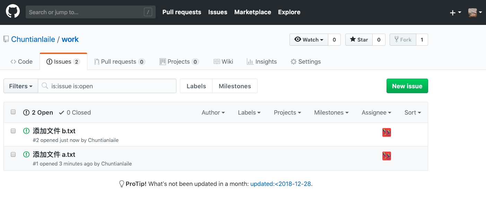

#### 四、添加 issue  😣😣

2022年3月28日17:20:38

---

切换到组长的 GitHub 页面，在仓库中添加一些项目任务或待解决问题，这些任务就是 issue：

写好任务标题后，可以在右侧指派一位或多位项目参与者来完成，同样 GitHub 也会给被指派者发邮件的（可以在自己的 GitHub 账号上设置拒收哪类邮件）：

写好两个 issue，前面说过的，组长仓库里的 issue 不会出现在组员仓库中：

下一步