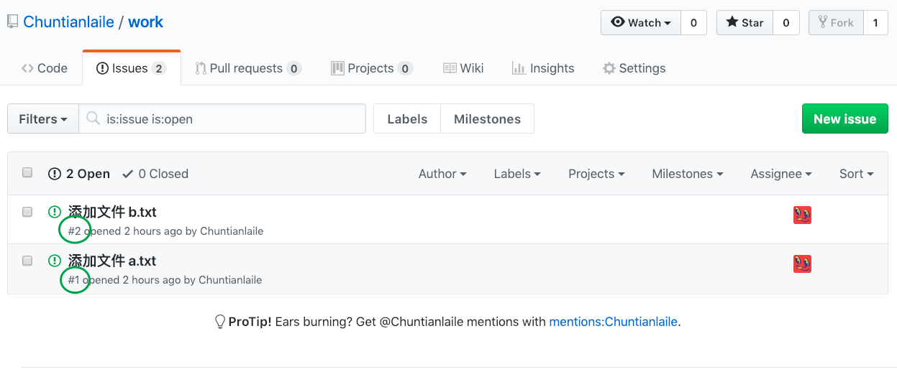
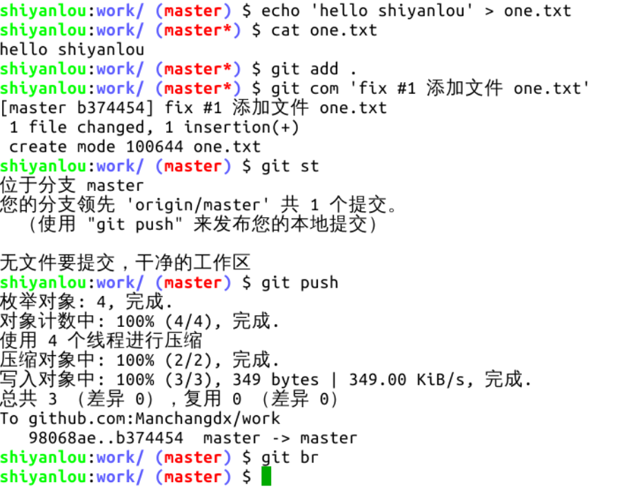
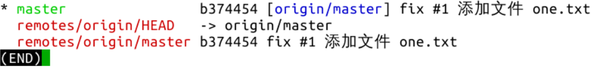
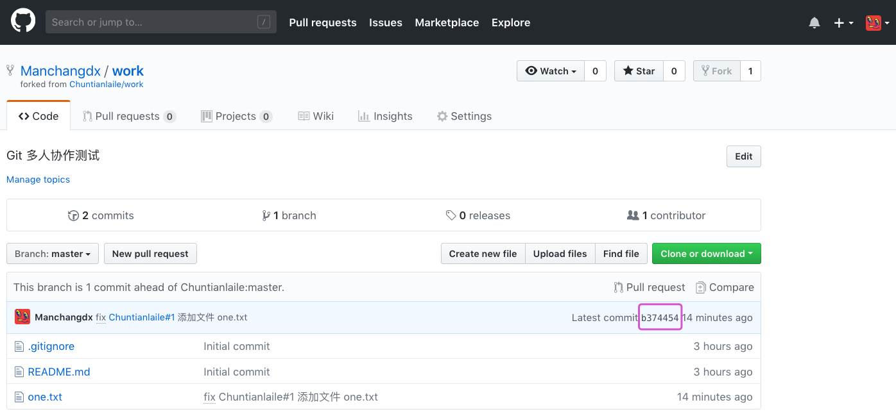

#### 二、完成任务并推送到自己的仓库  🤔🤔

2022年3月28日17:29:10

---

现在我们要完成组长仓库的一个 issue，注意每个 issue 在创建后都会生成一个编号，我们首先完成 1 号 issue：

创建文件，添加到暂存区，提交，查看本地仓库分支状态：

注意在执行 commit 命令时，备注信息里有个 “fix #1”，这是必要的，当备注信息中含有此字样的 commit 出现在组长仓库，仓库中编号为 #1 的 issue 就会自动关闭。类似的字样还有 “fixes #xxx、fixed #xxx、closes #xxx、close #xxx、closed #xxx”，这些并不重要，选择字母最少的 fix 就可以了。当然偶尔忘记写这个字样也不要紧的，issue 可以手动关闭，甚至关掉的 issue 还能再开。

完成以上操作，组员的 GitHub 仓库会发生变化，新增一个版本号为 b374 的提交：

