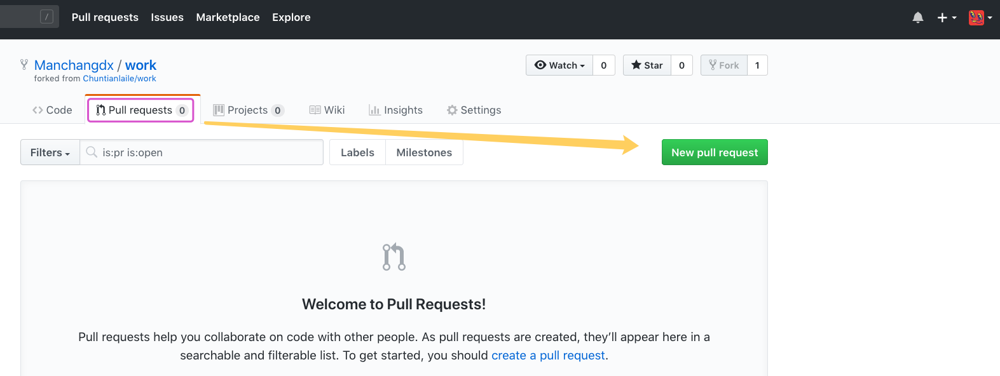
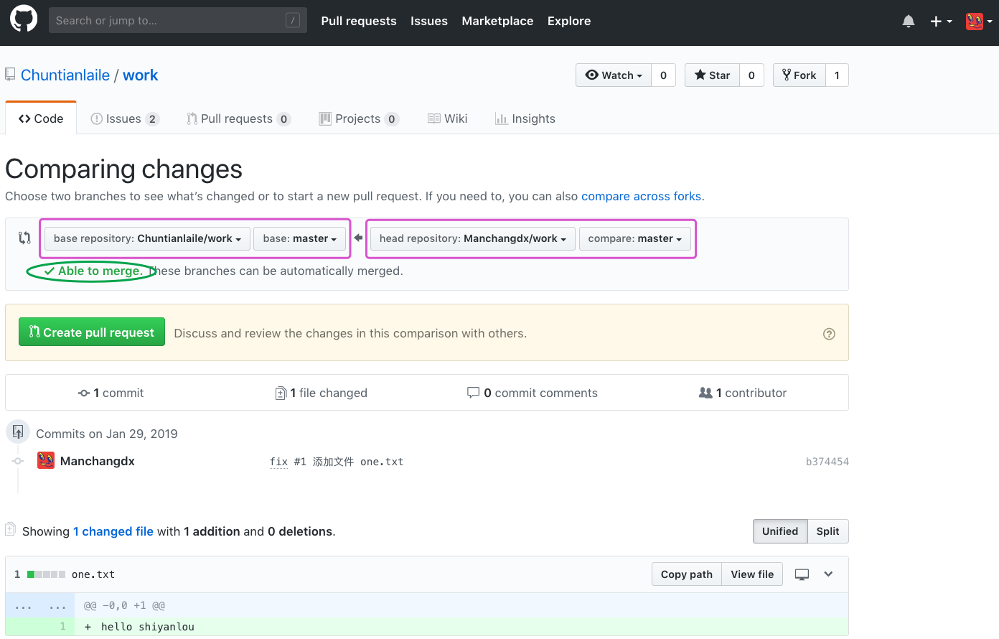
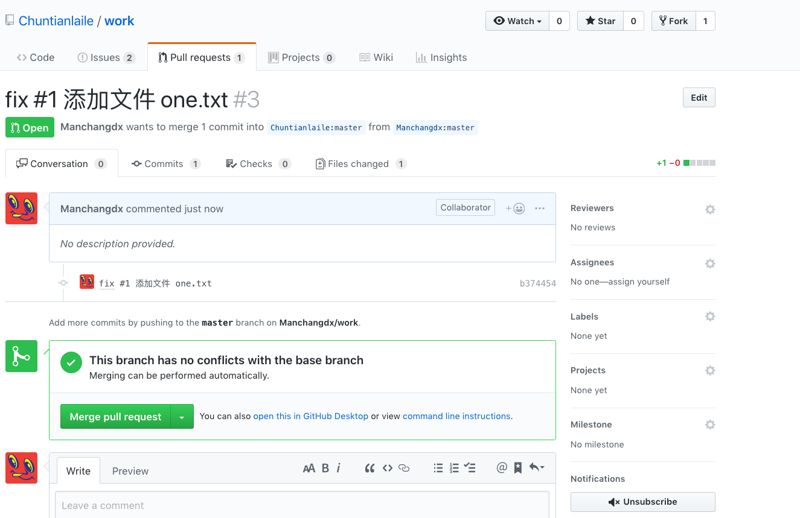
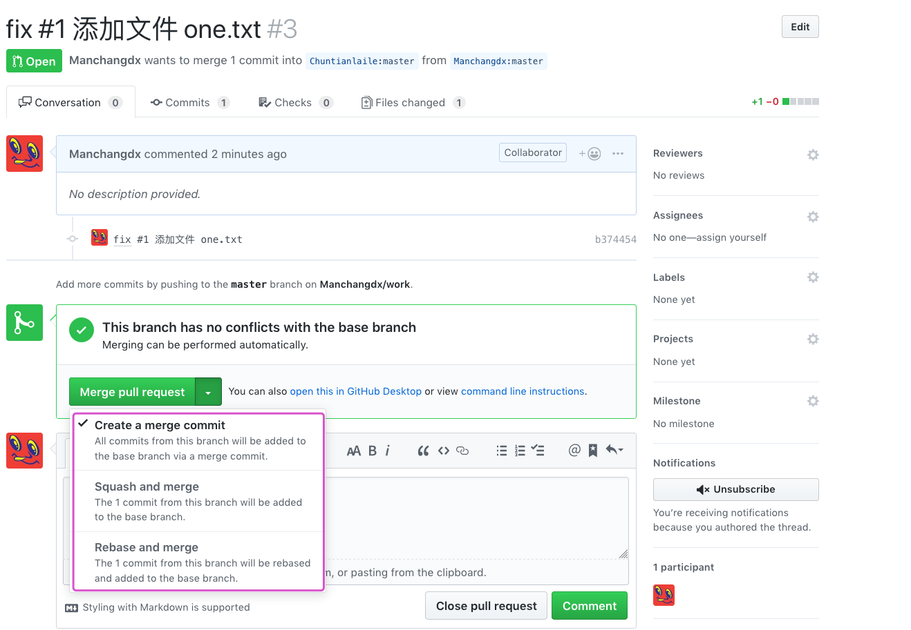
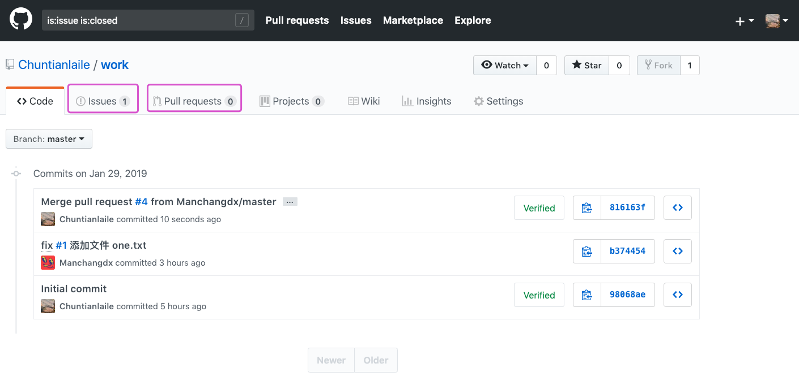

#### 提 PR & 检查合并 PR 😀😀

2022年3月28日17:30:40

---

接下来，怎么把修改从组员的仓库添加到组长的仓库呢？这就用到了 pull request 方法，简称 PR。这个词组比较费解，两个词都有动词属性，字面意思是 “拉，请求”，可以理解为这是一个名词性词组，意为 “允许被拉取的请求”，创建一个 PR 就是从甲分支向乙分支提一个请求，该请求中有一个或多个提交，对方觉得可以、没问题，就合并（merge) 这个请求，也就是把请求中所有提交的修改增加到乙分支上，整个过程简称 “提 PR”、“检查合并 PR”。提 PR 既可以在仓库内，也可以跨用户跨仓库。

好，现在我们从组员的 work 仓库 master 分支给组长的 work 仓库 master 分支提一个 PR：

如下图所示，仔细检查紫色框中的内容是否正确，再看绿色椭圆形框中的绿色字样 “Able to merge.”，说明这个 PR 中的修改跟目标分支没有冲突：

从上图还可得知一些信息：该 PR 里有 1 个提交，1 个文件改动，1 个贡献者。点击上图绿色按钮跳转到确认页面，再次点击下图绿色按钮即可完成本次 “提 PR” 工作：

完成后，页面自动跳转到组长的 work 仓库 PR 的合并页面：

该页面只有参与项目协作的成员有权限进入，当前 GitHub 的登录用户是组员，所以可见，且对这个仓库有完全的管理权限，除了删除仓库。当然了，检查合并 PR 的权限也是有的。重要的一点：提了 PR 之后，一定要求参与项目的其他成员来检查合并，不要自己来，尽管自己有权限。

上图中绿色按钮是个下拉按钮，合并 PR 的方法有三种，分别解释一下：

`Create a merge commit` ：这种方式会在组长仓库的 master 分支上生成一个新的提交，且保留 PR 中的所有提交信息。这是一种常规操作，用得最多。

`Squash and merge` ：压缩合并，它会把 PR 中的全部提交压缩成一个。此方法的优点就是让提交列表特别整洁。一个 PR 里有很多提交，每个提交都是很细小的改动，保留这些提交没什么意义，这种情况就使用此方法合并 PR。

`Rebase and merge` ：这种方法不会生成新的提交，例如 PR 中有 6 个提交，用此方法合并后，组长仓库也会新增 6 个提交。注意，这些提交的版本号与组员的提交不同，此外完全一样。

现在切换到另一个登录组长账号的浏览器，打开合并 PR 的页面，用第一种方法合并：

这就是第一种方式合并的结果，生成了一个新的提交，这个提交里没有修改。因为样子不太美观，这是我最不喜欢用的方式。仔细看上图的 issue，变成了 1 个，也就是说在合并 PR 后，#1 issue 被关闭了。

以上就是一次完整的修改、提交、推送、提 PR、合并 PR 的过程。

**需要注意的一点：从 A 向 B 提 PR 后，在 PR 合并或关闭前，A 上所有新增的提交都会出现在 PR 里。**

