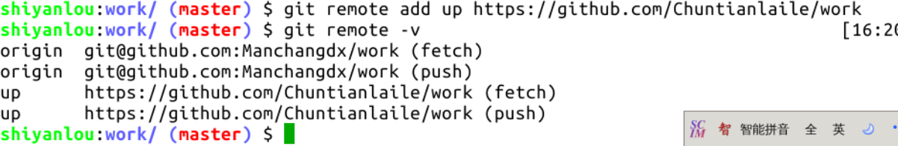
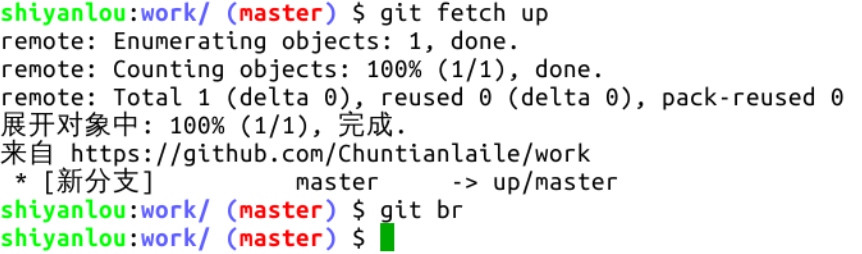
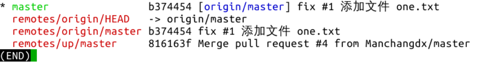
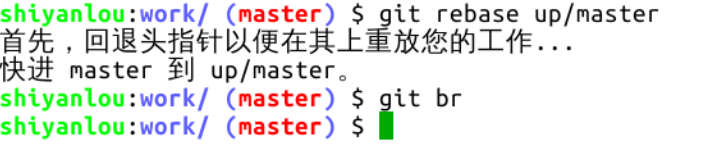
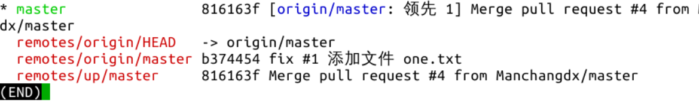

#### 四、同步主仓库 😛😛

2022年3月28日17:41:50

----

因为组长的 master 分支新增了一个空提交，所以需要让组员的仓库同步组长的仓库，使它们的提交版本一致。作为组员，要时刻保持自己的 master 分支与组长的一致，以避免在下次提 PR 时出现冲突，该操作叫做 “同步主仓库”，组长的仓库就是主仓库。

提 PR、合并 PR 只能在 GitHub 页面上操作。同步主仓库是要用 Git 操作的。现在回到实验环境中操作。首先，使用 `remote` 系列命令来增加一个关联主机，执行 `git remote add [主机名] [主仓库的地址]`，**注意，主仓库的地址使用 https 开头的：**

如上图所示，主机名是随意定义的，**只要不是 origin 就可以，因为自己的仓库地址对应的主机名是 origin**，主仓库的主机名通常定义为 up 或 upstream，这个主机名其实就是一个变量，它的值就是仓库地址，例如 `git push origin master` 完全等于 `git push git@github.com:Manchangdx/work master` 。

> 我们自己仓库是origin,  这里关联的是组长的仓库而不是自己的.所以不能是origin.

如此说来，关联主仓库后也没什么变化嘛，确实如此，即使地址写错也不会报出来。现在可以使用前面课程介绍过的 `fetch` 命令来拉取主仓库的全部分支信息到本地仓库了，我有时使用这个命令看上一个命令是否有拼写错误：

如何同步主仓库哩？方法有二，一是执行 `git pull --rebase up master` ，此命令需联网，二是执行 `git rebase up/master`，此命令不联网，因为前面已经执行了 `git fetch up` 这个需要联网的命令，本地已经有了最新的主仓库 master 分支信息，所以可以这么操作。

总结一下：`git pull --rebase` = `git fetch` + `git rebase`。现在使用方法二来同步：

同步主仓库已完成。现在可以继续修改提交自己的 master 分支了。然后一并推送到自己的远程仓库。

以上是在自己 Fork 的仓库里进行修改的过程。还有一种常用的方式，就是不用 Fork，直接克隆组长的仓库到本地，然后各自创建自己的分支，在自己的分支上进行修改提交，最后从自己的分支向 master 分支提 PR。方式不同，原理一样。

关于多人协作的 Git 操作就到这里了