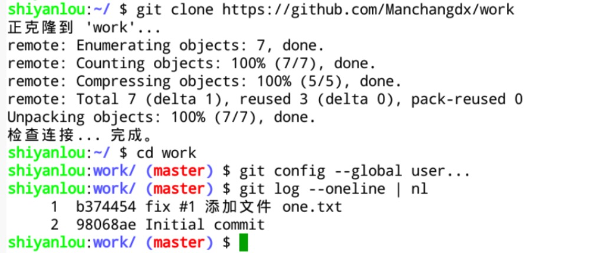
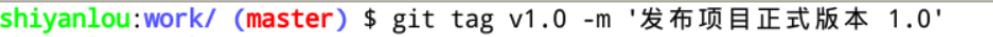

#### 1.1 创建标签  🤔🤔

2022年3月28日18:08:16

---

前面的课程提到过 GitHub 的 issue 功能，issue 是仓库拥有者在 GitHub 上手动创建的，仓库被 Fork 时 issue 不会跟随。T**ags 通常在本地使用 git 命令创建后推送到 GitHub 上，与 issue 相同的一点，它也只存在于项目仓库内，Fork 或提 PR 都不会带上它。在多人协作项目中，通常由组长对主仓库设置 Tags，**单人项目自然就是自己说了算。

开始操作。首先，克隆仓库、配置信息、查看提交版本历史：

重要的一点，我们创建标签是给具体的某次提交创建的，跟分支无关。创建标签使用 `git tag [标签名] -m [备注信息] [提交版本号]` 这个命令。其中 `-m [备注信息]` 可以省略不写，但建议不要省略。`[提交版本号]` 可以省略，如果是给当前分支最新的提交创建标签的话。

给当前分支当前版本创建一个标签：

> git log 输出如下:
>
> commit 19c9680d816112e6d974434036a04936d8132b56 (HEAD -> master, tag: v1.0)
> Author: e <e>
> Date:   Mon Mar 28 18:12:47 2022 +0800

这样一个本地标签就创建完成了。

