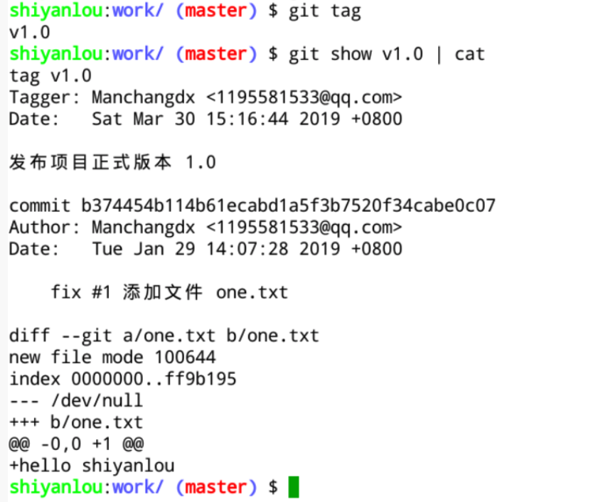

#### 1.2 查看标签   `git tag`😀😀😀

2022年3月28日18:16:23

----

执行 `git tag` 命令显示仓库中的全部标签列表，执行 `git show [标签名]` 查看标签详情：

前文已提到，标**签是在提交的基础上创建的，如果仓库的多个分支中都有这个提交版本，那么这些分支上就有关于这个提交的相同的标签。**

下面是创建一个新分支dev后 查看标签的结果, 可见这时候标签和之前一样.

> tag v1.0        // v1.0
> Tagger: e <e>
> Date:   Mon Mar 28 18:13:02 2022 +0800
>
> diyige banben   // 标签内容在此.
>
> commit 19c9680d816112e6d974434036a04936d8132b56 (HEAD -> dev, tag: v1.0, master)
> Author: e <e>
> Date:   Mon Mar 28 18:12:47 2022 +0800

