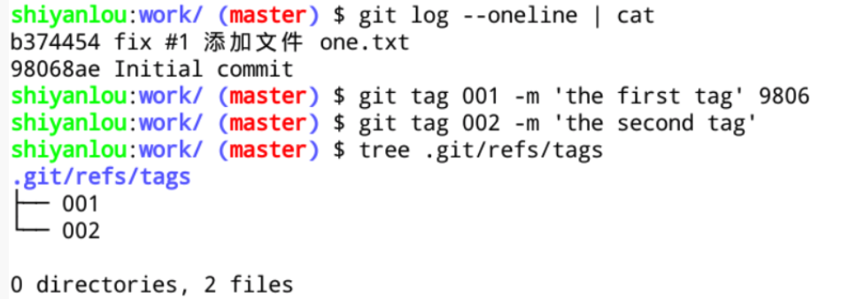
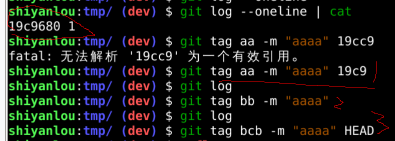
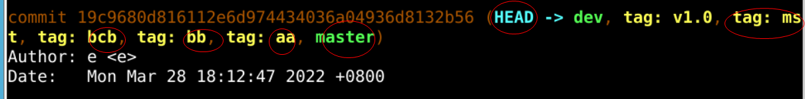
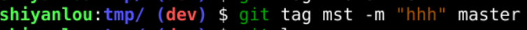
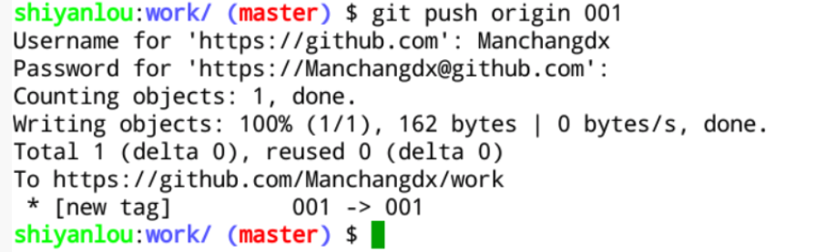
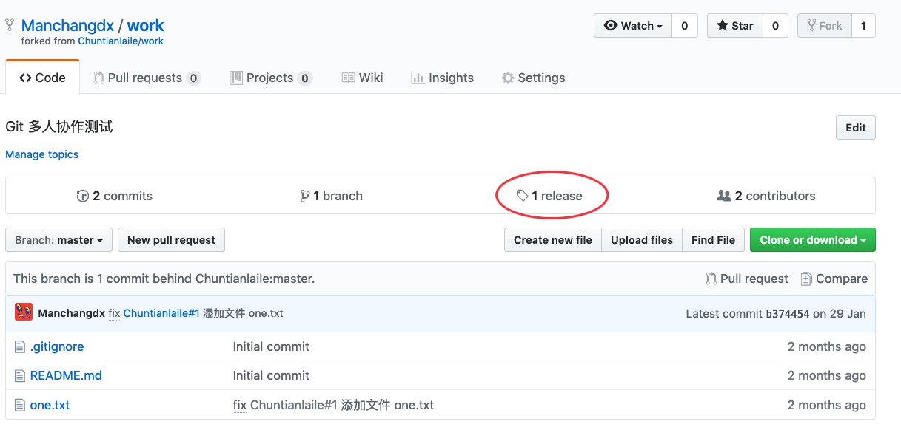
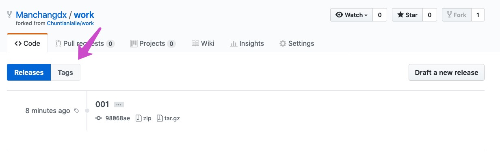
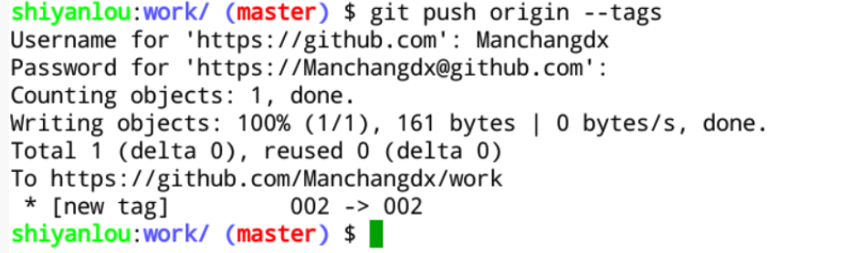
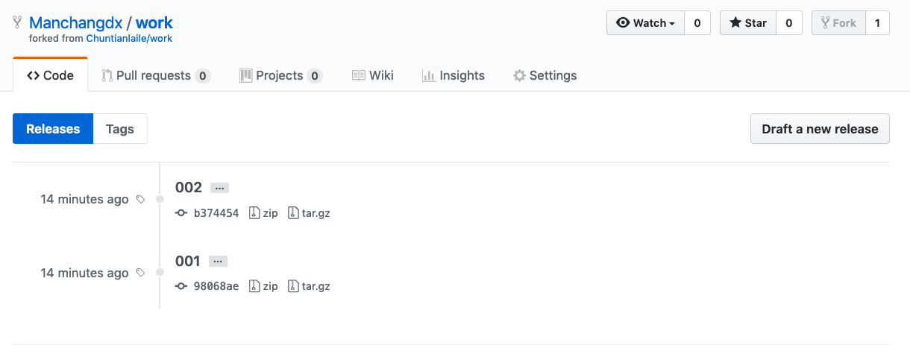

#### 1.4 将本地标签推送到远程仓库  😛😛😛

2022年3月28日18:26:12

---

首先对两个提交版本创建对应的标签：

> 添加标签 可以用  
>
> 1. HEAD 
> 2. 甚至可以HEAD^   为前面的提交增加标签, 
>
> 2. master(分支名) 
>
> 3. 哈希值. 
>
> 4. 默认
>
>    

执行 `git push origin [标签名]` 推送标签到远程仓库，注意前面的命令都只涉及本地操作不需要联网，此命令需要联网：

我们到浏览器上打开仓库主目录，点击下图红色框可以查看 releases 和 tags ：

点 Tags 按钮查看标签：

关于 releases 是什么，下文会介绍。

如果你一口气创建了 6 个标签，当然啦，这种情况很少发生，可以使用 `git push origin --tags` 命令将全部本地标签推送至远程仓库：

查看远程仓库情况：

