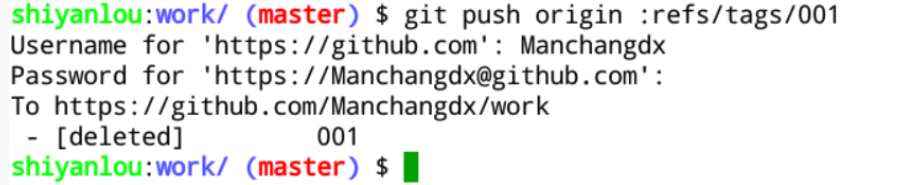
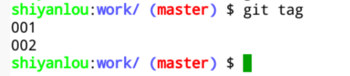

#### 1.5 删除远程仓库标签 😀😀

2022年3月28日18:40:08

---

如果标签废弃不用或者写错了，可以使用 `git push origin :refs/tags/[标签名]` 删除远程仓库的标签，命令中的标签名其实也就是文件名：

再次查看远程仓库：

好，删除成功。以上就是关于 Git 标签的创建、查看、推送、删除的操作流程。

查看本地仓库的标签列表：

咦，001 标签还在呢？是的，本地标签需要另外手动删除，上文已演示。

下一步