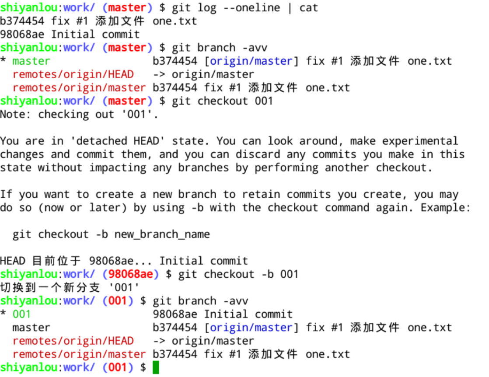

#### 1.6 签出版本  😂😂😂

2022年3月28日18:47:23

---

现在介绍一下关于 “签出版本” 的操作，我们会见到类似这种说明：**“如果你从 GitHub 上克隆了这个程序的仓库，那么可以在仓库主目录下执行 git checkout xxx 签出程序的这个版本。” 其实签出版本就是指定某个提交版本创建一个新的分支。**

假定当前的 work 仓库就是一个程序，我们要签出 001 版本，执行以下步骤即可。

首先执行 `git checkout [标签名]` 切换到之前的某个提交版本，然后执行 `git checkout -b [新的分支名]` 将此提交版本固定到一个新分支上并切换到此分支：

这样就利用标签完成了提交版本签出的工作