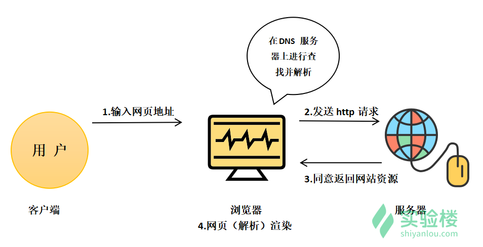

#### HTTP 基础  😀

2022年3月29日20:07:58

#### HTTP 概述

> 超文本传输协议（==HTTP，HyperText Transfer Protocol==)是互联网上应用最为广泛的一种网络协议。所有的 WWW 文件都必须遵守这个标准。设计 HTTP 最初的目的是为了提供一种发布和接收 HTML 页面的方法。1960 年美国人Ted Nelson 构思了一种通过计算机处理文本信息的方法，并称之为超文本（Hypertext）,这成为了 HTTP 超文本传输协议标准架构的发展根基。Ted Nelson 组织协调万维网协会（World Wide Web Consortium）和互联网工程工作小组（Internet EngineeCring Task Force ）共同合作研究，最终发布了一系列的 RFC，其中著名的 RFC 2616 定义了 HTTP 1.1。

注：定义来自于搜狗百科。

上图描述了客户端和服务器的交互过程。当用户在浏览器输入网址后，浏览器与服务器建立了一个连接，浏览器给 Web 服务器发送了一个 HTTP 请求，服务器接收并解析请求后，返回响应。HTTP 响应中包含状态代码和返回资源的内容（响应正文）。

#### 常见状态码

- 200 ：成功。
- 400 ：客户端请求有语法错误，服务器端不能理解。Cc
- 401 ：该请求可能未经过授权。
- 403 ：服务器端收到该请求，但是拒绝为它提供服务，可能是没有权限等等。
- 404 ：该资源没找到。
- 500 ：服务器端发生了一个不可预知的错误。
- 503 ：服务器端当前还不能处理客户端的这个请求，可能过段时间之后才能恢复正常。