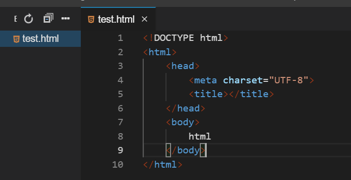
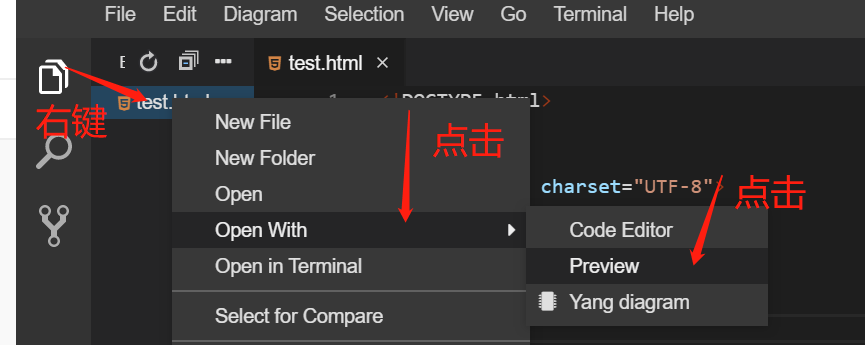
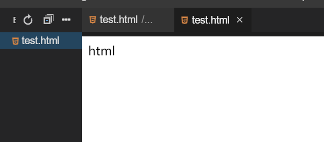

#### HTML 网页编辑与显示

2022年3月29日20:11:01

---

由于实验楼使用是 WebIDE 的在线环境，所以有不熟悉对同学请阅读下：[实验楼 WebIDE 使用指南](https://www.lanqiao.cn/library/shiyanlou-docs/feature/webide)，前端开发部分的内容。

点击 `File`，然后点击 `New File`，输入 `test.html` 新建一个 `test.html` 文件。后续的例子中，将不再提醒建立 `test.html` 文件，大家根据个人需求自行创建对应的 html 文件，完成后续操作)：


输入以下内容：

```html
<!DOCTYPE html>
<html>
  <head>
    <meta charset="UTF-8" />
    <title></title>
  </head>
  <body>
    html
  </body>
</html>
```



右键新建的 `test.html` 文件，点击 `Open With` 后选择 `Preview` 查看效果。



