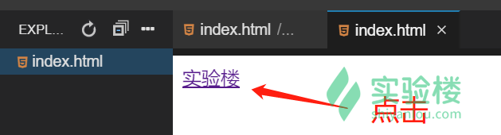

#### HTML 常见标签

2022年3月29日20:20:37

---

####  h系类标签

`h` 标签有六种 `h1`，`h2`，`h3`，`h4`，`h5`，`h6`，它代表着我们的标题。

```html
<!DOCTYPE html>
<html>
  <head>
    <title>HTML 简介</title>
    <meta charset="utf-8" />
  </head>
  <body>
    <h1>我是一级标题</h1>
    <h2>我是二级标题</h2>
    <h3>我是三级标题</h3>
    <h4>我是四级标题</h4>
    <h5>我是五级标题</h5>
    <h6>我是六级标题</h6>
  </body>
</html>
```


#### p 标签

`p` 标签是我们的文本标C签。删掉上段代码 `<body>` 标签里的内容，把下面的内容放到 `<body>` 标签里面去。

```html
<p>我是第一段文字，实验楼，做实验，学编程</p>
<p>我是第二段文字，实验楼，做实验，学编程</p>
```


#### 图片标签

HTML 的图像是通过标签 `` 来定义的。 语法: `` 。

```html
<p>实验楼图片：</p>

```


#### a 标签

<a> 标签是超链接标签，意思就是我们点击它可以跳转到一个网页。

```html
<a href="https://www.lanqiao.cn/">实验楼</a>
```

点击文字：



跳转指定页面：


#### div 标签

<div> 标签是一个块级元素，块级元素占据其父元素（容器）的整个空间，你可以把它想成一个盒子。 <div> 能够设置其宽高，后面我们会讲到。

```html
<div style="width:200px;height:200px;background:pink">块级元素</div>
```

这里设置的 style，后面我们会进行学习，现在只是为了便于产生效果，使大家更好理解。在这里的效果是生成一个宽高 200 像素的粉色 div。


#### 换行标签和空格字符

在浏览器显示页面时，浏览器会移除源代码中多余的空格和空行，所有连续的空格或空行都会被认为是一个空格。如果希望在不产生一个新段落的情况下换行，可以使用 `<br/>` 标签。如果想使用空格的话可以使用 ` ` 字符。

```html
<body>
  <p>这是一段文字 前面有很多空格但是只显示一个</p>
  <p>这是一段文字&nbsp;&nbsp;&nbsp;&nbsp;用了空格字符</p>
  <br />
  <p>上面是换行符</p>
</body>
```


#### 水平分割线

`<hr/>` 标签用于在 HTML 页面中创建一条水平线。

```html
<body>
  <hr />
  <hr />
  <hr />
</body>
```


下一步