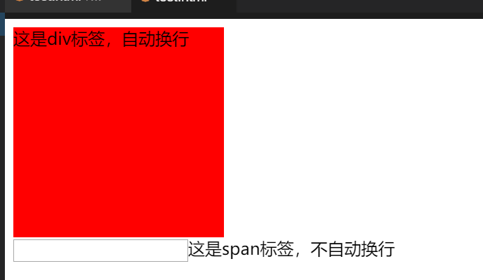

#### 容器标签（div 和 span） 😀

2022年3月29日20:24:36

---

接下来我们介绍两种容器标签。

#### 标签

标签 `<div>` 可将网页页面分割成不同的独立部分，通常用于定义文档中的区域或节。该标签是一个块级元素，浏览器会自动在 `<div>` 和 `</div>` 所标记的区域前后自动放置一个换行符。

#### span 标签

标签 `<span>` 通常作为文本的容器，它没有特定的含义和样式，只有与 CSS 同时使用才可以为指定文本设置样式属性。该标签是一个内联元素，他与块级元素相反，内联元素不会自动在前后自动放置换行符，因此内联元素会默认显示在同一行。

```html
<!DOCTYPE html>
<html lang="en">
  <head>
    <meta charset="utf-8" />
    <style>
      #box {
        width: 200px;
        height: 200px;
        background: red;
      }
    </style>
  </head>
  <body>
    <div id="box">这是div标签，自动换行</div>
    <input type="text" /><span>这是span标签，不自动换行</span>
  </body>
</html>
```



