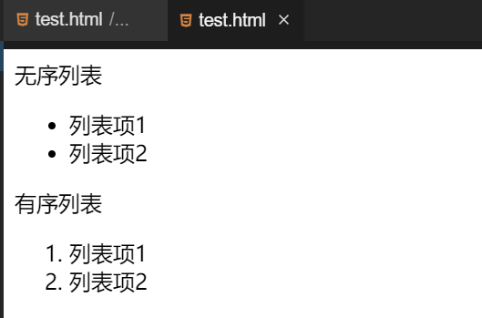
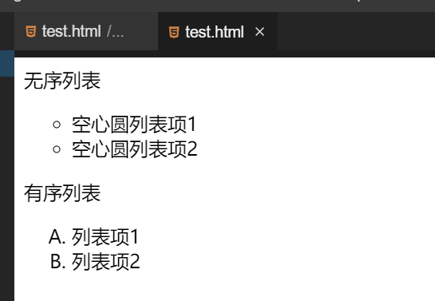
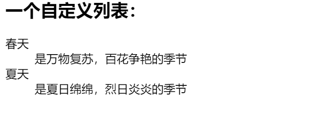

#### HTML 列表 `ul`  `ol` `li` `dl` `dt` `dd`

2022年3月29日20:26:23

---

列表作为网页设计的重要内容之一，**能够用来制作导航栏和新闻列表**等。HTML 列表分为：有序列表（ol），无序列表（ul）以及自定义列表（dl）。

#### 无序列表与有序列表

无序列表是一个项目的列表，此列项目使用实心圆、空心圆、方块进行标记，无序列表使用 `<ul>` 标签。同样，有序列表也是一列项目，列表项目使用数字进行标记。有序列表始于 `<ol>` 标签。每个列表项始于 `<li>` 标签。

```html
<p>无序列表</p>
<ul>
  <li>列表项1</li>
  <li>列表项2</li>
</ul>

<p>有序列表</p>
<ol>
  <li>列表项1</li>
  <li>列表项2</li>
</ol>
```



可以看到有多少个列表项就有多少个 `<li>` 标签。

**无序列表和有序列表的 type 属性：**

type 属性定义了列表项前项目符号的类型。

`<ul>` 标签的 type 属性：

| 值           | 备注   |
| ------------ | ------ |
| disc（默认） | 实心圆 |
| circle       | 空心圆 |
| square       | 小方块 |

`<ol>` 标签的 type 属性：

| 值        | 备注                        |
| --------- | --------------------------- |
| 1（默认） | 数字表示（1，2，3...)       |
| A         | 大写字母表示（A,B,C...)     |
| a         | 小写字母表示（a,b,c...)     |
| I         | 大写罗马数字表示(I,II,III…) |
| i         | 小写罗马数字表示(i,ii,iii…) |

我们来看其中一两个 type 属性：

```html
<p>无序列表</p>
<ul type="circle">
  <li>空心圆列表项1</li>
  <li>空心圆列表项2</li>
</ul>

<p>有序列表</p>
<ol type="A">
  <li>列表项1</li>
  <li>列表项2</li>
</ol>
```



是不是很简单呢？只需要修改 type 属性，就可以看到不同的项目符号了，自己动手试试其他的吧！

#### 自定义列表（dl）

定义：自定义列表不仅仅是一列项目，而是项目及其注释的组合。自定义列表以 `<dl>` 标签开始。每个自定义列表项以 `<dt>` 开始。每个自定义列表项的定义以 `<dd>` 开始。自定义列表的列表项前没有任何项目符号。

语法格式：

```html
<dl>
  <dt>名词1</dt>
  <dd>名词1解释1</dd>
  ...
  <dt>名词2</dt>
  <dd>名词2解释1</dd>
  ...
</dl>
```

例子：

```html
<h2>一个自定义列表：</h2>
<dl>
  <dt>春天</dt>
  <dd>是万物复苏，百花争艳的季节</dd>
  <dt>夏天</dt>
  <dd>是夏日绵绵，烈日炎炎的季节</dd>
</dl>
```

在浏览器中的运行效果为：

