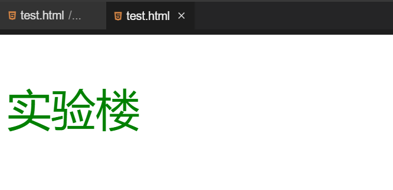

#### HTML 样式

2022年3月29日20:32:57

---

学习了上面所介绍的标签以后，我们将学习为所有的 HTML 标签定义 style 属性，通过 style 属性来改变 HTML 元素的样式。

#### HTML 样式实例 - 背景颜色

```html
<html>
  <body>
    <p style="background-color:red">实验楼</p>
  </body>
</html>
```

注：通过 `"background-color"` 属性值的设置来给背景设置颜色。


#### HTML 样式实例 - 字体、颜色和尺寸

```html
<html>
  <body>
    <p style="font-family:arial;color:green;font-size:50px;">实验楼</p>
  </body>
</html>
```

注：通过对 `font-family` 属性值的设置来设置字体，通过对 `color` 属性值的设置来设置颜色，通过对 `font-size` 属性值的设计来设计字体大小。



#### HTML 样式实例 - 文本对齐

```html
<html>
  <body>
    <h1 style="text-align:center">实验楼</h1>
  </body>
</html>
```

注：上面的标题“实验楼”相对于页面居中对齐。

