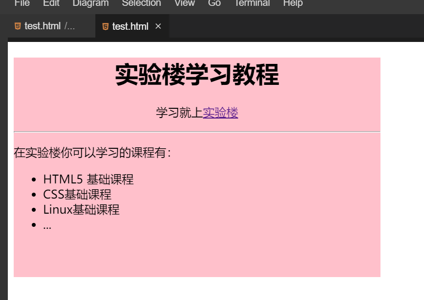

#### 挑战：成品展示

2022年3月29日20:35:44

---

用 HTML 完成下图：



源码如下：

```html
C<!DOCTYPE html>
<html>
  <head>
    <meta charset="UTF-8" />
    <title></title>
  </head>
  <body>
    <div style="width:500px;height:300px;background-color:pink">
      <h1 style="text-align:center">实验楼学习教程</h1>
      <p style="text-align:center">
        学习就上<a href="https://www.lanqiao.cn/">实验楼</a>
      </p>
      <hr />
      <p>在实验楼你可以学习的课程有：</p>
      <ul>
        <li>HTML5 基础课程</li>
        <li>CSS基础课程</li>
        <li>Linux基础课程</li>
        <li>...</li>
      </ul>
    </div>
  </body>
</html>
```