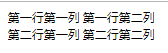
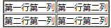

#### 创建表格 `table`  `tr` `td` `border`

2022年3月29日20:37:50

---

表格由 `<table>` 标签来定义。每个表格均有若干行（由 `<tr>` 标签定义），每行被分割为若干单元格（由 `<td>` 标签定义）。字母 td 指表格数据（table data），即数据单元格的内容。数据单元格可以包含文本、图片、列表、段落、表单、水平线、表格等等。

我们先来创建一个简单的表格：

```html
<table>
  <tr>
    <td>第一行第一列</td>
    <td>第一行第二列</td>
  </tr>
  <tr>
    <td>第二行第一列</td>
    <td>第二行第二列</td>
  </tr>
</table>
```



你是否发现好像缺了点什么？这个表格为什么没有边框呢？接下来让我们为它添加一个 `border` 属性再来看看效果。

```html
<table border="1">
  <tr>
    <td>第一行第一列</td>
    <td>第一行第二列</td>
  </tr>
  <tr>
    <td>第二行第一列</td>
    <td>第二行第二列</td>
  </tr>
</table>
```

在浏览器显示效果为：




C下一步