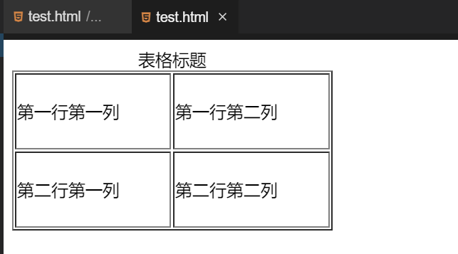
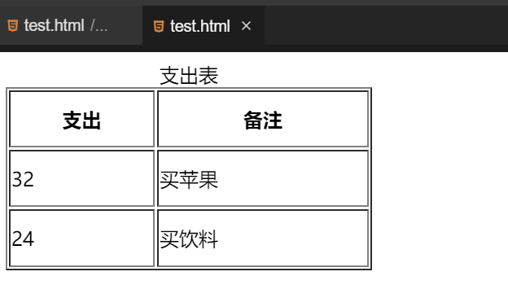
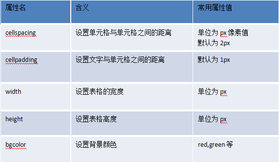
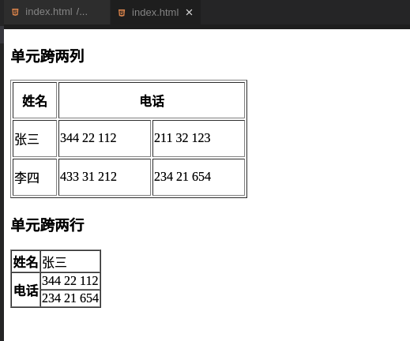

#### 完善表格   `th` `caption`😉

2022年3月29日20:40:26

---

#### caption 元素定义表格标题

表格一般都有标题，在 HTML 中表格标题通过 `<caption>` 定义。

```html
<table border="1" width="300px" height="150px">
  <caption>
    表格标题
  </caption>
  <tr>
    <td>第一行第一列</td>
    <td>第一行第二列</td>
  </tr>
  <tr>
    <td>第二行第一列</td>
    <td>第二行第二列</td>
  </tr>
</table>
```



#### 给表格添加表头

表格的表头使用 `<th>` 标签进行定义，表头通常用于列名字。

```html
<table border="1" width="300px" height="150px">
  <caption>
    支出表
  </caption>
  <tr>
    <th>支出</th>
    <th>备注</th>
  </tr>
  <tr>
    <td>32</td>
    <td>买苹果</td>
  </tr>
  <tr>
    <td>24</td>
    <td>买饮料</td>
  </tr>
</table>
```



#### 表格与单元格的属性

表格的其他常用属性：



注意：其余属性的使用和 `border` 类似，只需要在 `table` 标签中添加属性即可，大家可以尝试着使用。

#### 单元格跨行和跨列

绘制表格的时候，我们常常需要合并单元格，而在 HTML 中提供了 colspan（合并列）和 rowspan（合并行）属性来帮助我们实现这一效果。

> colspan 又称跨列，rowspan 又称跨行。

```html
<table border="1" width="300px" height="150px">
  <h3>单元跨两列</h3>
  <tr>
    <th>姓名</th>
    <th colspan="2">电话</th>
  </tr>
  <tr>
    <td>张三</td>
    <td>344 22 112</td>
    <td>211 32 123</td>
  </tr>
  <tr>
    <td>李四</td>
    <td>433 31 212</td>
    <td>234 21 654</td>
  </tr>
</table>

<table border="1" cellspacing="0">
  <h3>单元跨两行</h3>
  <tr>
    <th>姓名</th>
    <td>张三</td>
  </tr>
  <tr>
    <th rowspan="2">电话</th>
    <td>344 22 112</td>
  </tr>
  <tr>
    <td>234 21 654</td>
  </tr>
</table>
```

在浏览器中显示效果为：



注：设置 `rowspan="2"` 表示合并该列上的两个单元格，同样的我们可以通过设置 `colspan` 来合并行，快动手试试吧。合并之前，我们可以如例子般，先把所有的单元格都写出来，然后找出哪些单元格需要合并的，在第一个单元格内设置 `rowspan` 或者 `colspan`，并将其他多余的单元格代码删除。