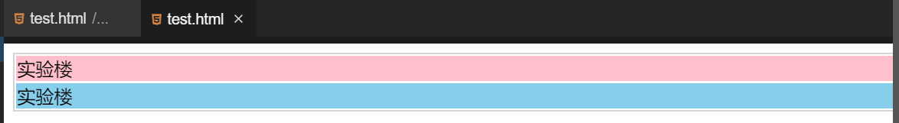

#### div 设置  😂😂

2022年3月29日20:44:48

---

在网页中可以使用很多个 div，在网页制作中，使用 div 可以将网页中的任何元素布局到网页中的任何位置。

语法：

```html
<div style="样式设置"><div></div></div>
```

#### div 和 table 的区别

div 布局：

```html
<div style="width:100%;border:1px solid #d4d4d4">
  <div style="background-color:pink">实验楼</div>
  <div style="background-color:skyblue">实验楼</div>
</div>
```

table 布局：

```html
<table style="width:100%;border:1px solid #d4d4d4">
  <tr>
    <td style="background-color:pink">实验楼</td>
  </tr>
  <tr>
    <td style="background-color:skyblue">实验楼</td>
  </tr>
</table>
```

两个布局的最终效果：



同样的效果，使用 div 布局能比表格更加灵活，但是我们需要根据不同的场景使用不同的布局方式，现在我们来看看两种布局的优缺点。

table 元素布局：

- 优点：

1. 理解比较简单。
2. 不同的浏览器看到的效果一般相同。

- 缺点：

1. 显示样式和数据绑定在一起。
2. **布局的时候灵活度不高**。
3. 一个页面可能会有大量的 table 元素，代码冗余度高。
4. 增加带宽。
5. 搜索引擎不喜欢这样的布局。

div 元素布局：

- 优点：

1. 符合 W3C 标准。
2. **搜索引擎更加友好。**
3. **样式的调整更加方便，内容和样式的分离，使页面和样式的调整变得更加方便。**
4. 节省代宽，代码冗余度低。
5. **表现和结构分离，在团队开发中更容易分工合作而减少相互关联性。**

