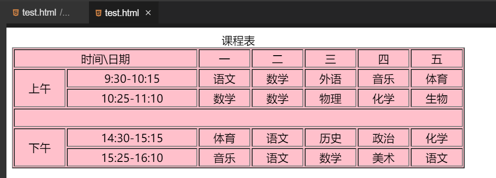

#### 挑战：课程表绘制  😀😀

2022年3月29日20:45:34

请你尝试着根据我们前面所需的内容绘制如下所示的课程表：



源码如下：

```html
<!DOCTYPE html>
<html lang="en">
  <head>
    <meta charset="UTF-8" />
    <title>课程表</title>
  </head>
  <body>
    <table border="1" width="60%" bgcolor="pink" cellpadding="2">
      <caption>
        课程表
      </caption>
      <tr align="center">
        <td colspan="2">时间\日期</td>
        <td>一</td>
        <td>二</td>
        <td>三</td>
        <td>四</td>
        <td>五</td>
      </tr>

      <tr align="center">
        <td rowspan="2">上午</td>
        <td>9:30-10:15</td>
        <td>语文</td>
        <td>数学</td>
        <td>外语</td>
        <td>音乐</td>
        <td>体育</td>
      </tr>

      <tr align="center">
        <td>10:25-11:10</td>
        <td>数学</td>
        <td>数学</td>
        <td>物理</td>
        <td>化学</td>
        <td>生物</td>
      </tr>

      <tr>
        <td colspan="7">&nbsp;</td>
      </tr>

      <tr align="center">
        <td rowspan="2">下午</td>
        <td>14:30-15:15</td>
        <td>体育</td>
        <td>语文</td>
        <td>历史</td>
        <td>政治</td>
        <td>化学</td>
      </tr>

      <tr align="center">
        <td>15:25-16:10</td>
        <td>音乐</td>
        <td>语文</td>
        <td>数学</td>
        <td>美术</td>
        <td>语文</td>
      </tr>
    </table>
  </body>
</html>
```