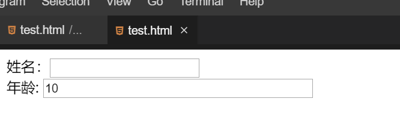

#### 插入表单对象

2022年3月30日19:28:12

---

网页中的表单由许多不同的表单元素组成，这些表单元素包括文字字段、单选按钮、复选框、按钮等。

#### 文字字段

在网页中最常见的表单元素就是文字字段，用户可以在文字字段内输入字符或者单行文本。 语法：

```html
<input
  type="text"
  name="控件名称"
  value="文字字段的默认取值"
  size="控件的长度"
  maxlength="最长字符数"
/>
```

该语法包含了许多参数，除了 `type` 参数以外，其他的参数都是可选的，大家可以自行选择。举个例子：

```html
<form name="formBox" method="post" action="">
  姓名：<input type="text" name="name" size="20" /><br />
  年龄:<input type="text" name="age" size="40" value="10" maxlength="3" />
</form>
```



可以尝试给年龄输入值，如果文本字段长度超过了 3，就不能再输入了。

#### 密码输入框

密码输入框是一种特殊的文字字段，他的各个属性和文字字段是相同的，但是输入进密码输入框的字符全部是“*”表示，保证周围人看不见输入的文本。

```html
<input type="password" name="pwd" />
```

#### 单选按钮

单选按钮可以使用户从选择列表中选择一个选项。

```html
<form name="formBox" method="post" action="">
  <input type="radio" name="sex" value="male" checked />男<br />
  <input type="radio" name="sex" value="female" />女
</form>
```

几个单选按钮可以连接在一起，只需要把它们的 `name` 值设置为相同的。同一组中只有一个按钮可以同时被选。如果没有选中任何一个，那么整个单选按钮池就被认为处于未知状态，且不会随表单提交。 可以尝试如果 name 不相同或者没有 name 会是什么情况。

#### 复选框

复选框可以让用户从一个选项列表中选择超出一个的选项。

```html
<form name="formBox" method="post" action="">
  <input type="checkbox" name="music" checked />音乐<br />
  <input type="checkbox" name="art" />美术<br />
  <input type="checkbox" name="math" />数学<br />
</form>
```

复选框可以拥有自己的名字，并不需要属于一个组。

#### 按钮

HTML 表单中，有三种按钮：提交按钮，重置按钮，匿名按钮。我们可以使用 `<button>` 元素或者 `<input>` 元素来创建一个按钮。`type` 属性的值指定显示什么类型的按钮。

**提交按钮（submit）**

用于发送表单数据给服务器。

语法：

```html
<form name="formBox" method="post" action="">
  <input type="text" value="输入的内容" />
  <button type="submit">This a submit button</button>

  <!--or-->

  <input type="submit" value="This is a submit button" />
</form>
```

**重置按钮（reset）**

重置按钮用来清除用户在页面中输入的信息。

语法：

```html
<form name="formBox" method="post" action="">
  <input type="text" />
  <button type="reset">This a reset button</button>

  <!--or-->

  <input type="reset" value="This is a reset button" />
</form>
```

在文本框中输入内容，点击按钮即可清除。

**匿名按钮（button）**

没有自动生效的按钮，但是可以使用 JavaScript 代码进行定制。如果你省略了 `type` 属性，那么这就是默认值。

语法：

```html
<button type="button">This a anonymous button</button>

<!--or-->
<button>This a anonymous button</button>

<!--or-->
<input type="button" value="This is a anonymous button" />
```

不管使用的是 `<button>` 元素还是 `<input>` 元素，按钮的行为都是一样的。它们的不同点在于：

- 从前面的例子中也可以看出 `<button>` 元素允许你使用 HTML 内容作为其标记内容，但 `<input>` 元素只接受纯文本内容。
- 使用 `<button>` 元素，可以有一个不同于按钮标签的值（通过将其设置为 `value` 属性）。（但是在 IE 8 之前的版本中是不行的）。


