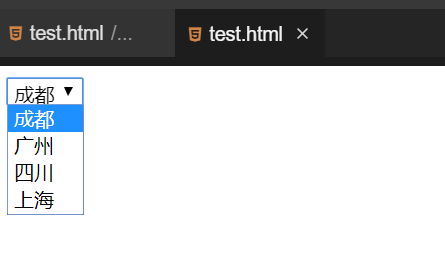

#### 菜单和列表 

2022年3月30日19:58:32

---

菜单和列表主要是用来选择给定答案中的一种，这类选择中往往答案比较多。

#### 下拉菜单

下拉菜单能够节省页面空间，正常状态下显示一个选项，单击展开所以选项。

```html
<form name="formBox" method="post" action="">
  <select name="select">
    <option value="成都">成都</option>
    <option value="广州">广州</option>
    <option value="四川">四川</option>
    <option value="上海">上海</option>
  </select>
</form>
```



注意：下拉菜单的宽度是由 `<option>` 标记中包含的最长文本的宽度决定的。

#### 列表项

在页面中列表项可以显示出几条信息，一旦超出这个信息量，在列表项右侧会出现滚动条，拖动滚动条可以看到所有选项。

```html
<form name="formBox" method="post" action="">
  <select name="select" size="2" multiple="multiple">
    <option value="成都">成都</option>
    <option value="广州">广州</option>
    <option value="四川">四川</option>
    <option value="上海">上海</option>
  </select>
</form>
```


`size="2"` 表示一次显示 2 条数据。