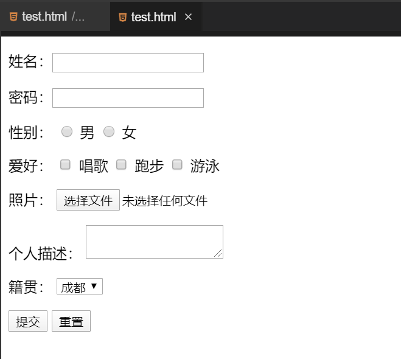

#### 挑战：表单综合案例

2022年3月30日20:06:47

---

先来看看我们需要完成的页面效果：



源码如下：

```html
<!DOCTYPE html>
<html lang="en">
  <head>
    <meta charset="UTF-8" />
    <title></title>
  </head>
  <body>
    <form action="" method="get">
      <p>姓名：<input type="text" name="username" /></p>

      <p>密码：<input type="password" name="password" /></p>

      <p>
        性别：
        <input type="radio" name="gender" value="0" /> 男
        <input type="radio" name="gender" value="1" /> 女
      </p>
      <p>
        爱好：
        <input type="checkbox" name="like" value="sing" /> 唱歌
        <input type="checkbox" name="like" value="run" /> 跑步
        <input type="checkbox" name="like" value="swimming" /> 游泳
      </p>
      <p>
        照片：
        <input type="file" name="person_pic" />
      </p>
      <p>
        个人描述：
        <textarea name="about"></textarea>
      </p>
      <p>
        籍贯：
        <select name="select">
          <option value="成都">成都</option>
          <option value="广州">广州</option>
          <option value="四川">四川</option>
          <option value="上海">上海</option>
        </select>
      </p>
      <p>
        <input type="submit" name="" value="提交" />
        <input type="reset" name="" value="重置" />
      </p>
    </form>
  </body>
</html>
```