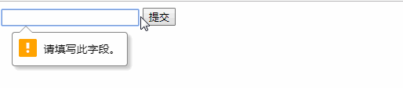

#### HTML5 表单新增的属性

2022年3月31日17:45:59

---

#### autocomplete 属性

`autocomplete` 属性规定表单是否应该启用自动完成功能：自动完成允许浏览器预测对字段的输入，当用户在字段开始键入时，浏览器基于之前键入过的值，应该显示出在字段中填写的选项。当 `autocomplete` 属性值为 `on` 时表示启用自动完成功能，为 `off` 时表示关闭。`autocomplete` 属性适用于 `<form>`，以及下面的 `<input>` 类型：`text`, `search`, `url`, `telephone`, `email`, `password`, `datepickers`, `range` 以及 `color`。

例子：

```html
<body>
  <form action="#" method="get" autocomplete="on">
    Name:<input type="text" name="name" /><br />
    E-mail: <input type="email" name="email" autocomplete="off" /><br />
    <input type="submit" value="提交" />
  </form>
</body>
```

运行效果为：


#### autofocus 属性

`autofocus` 属性规定在页面加载时，域自动地获得焦点。适用于所有 `<input>` 标签的类型。

例子：

```html
<body>
  <form action="#" method="get">
    Name：<input type="text" name="user_name" autofocus="autofocus" /><br />
    <input type="submit" value="提交" />
  </form>
</body>
```

运行效果为：


注：大家可以把上面代码中 `autofocus` 属性删掉对比看看效果。

#### form 属性

`form` 属性规定输入域所属的一个或多个表单。`form` 属性适用于所有 `<input>` 标签的类型。`form` 属性必须引用所属表单的 `id`。

例子：

```html
<body>
  <form action="#" method="get" id="user_form">
    First name:<input type="text" name="fname" />
    <input type="submit" value="提交" />
  </form>

  <p>
    下面的输入域在 form 元素之外，但仍然是表单的一部分， 也就是说提交按钮会把
    first name 和 last name的值都提交。
  </p>

  Last name: <input type="text" name="lname" form="user_form" />
</body>
```

运行效果为：


注：如需引用一个以上的表单，请使用空格分隔的列表。

#### multiple 属性

`multiple` 属性规定输入域中可选择多个值，适用于以下类型的 `<input>` 标签：`email` 和 `file`。

例子：

```html
<body>
  <form action="#" method="get" id="user_form">
    选择文件: <input type="file" name="file" multiple="multiple" />
    <input type="submit" value="提交" />
  </form>
</body>
```

#### novalidate 属性

`novalidate` 属性规定在提交表单时不应该验证 `form` 或 `input` 域。适用于 `<form>`，以及下面的 `<input>` 类型：`text`, `search`, `url`, `telephone`, `email`, `password`, `datepickers`, `range` 以及 `color`。

例子：

```html
<body>
  <form action="#" method="get" id="user_form" novalidate="true">
    E-mail: <input type="email" name="user_email" />
    <input type="submit" value="提交" />
  </form>
</body>
```

#### pattern 属性

`pattern` 属性规定用于验证 `input` 域的模式（pattern）。模式（pattern） 是正则表达式。`pattern` 属性适用于以下类型的 `<input>` 标签：`text`, `search`, `url`, `telephone`, `email` 以及 `password`。

例子：

```html
<body>
  <form action="#" method="get">
    Name:
    <input type="text" name="name" pattern="[A-z]{4}" title="请输入四个字母" />
    <input type="submit" value="提交" />
  </form>
</body>
```

运行效果为：


注：想要了解更多正则表达式的语法，请访问[正则表达式手册](http://tool.oschina.net/uploads/apidocs/jquery/regexp.html)。

#### placeholder 属性

`placeholder` 属性提供一种提示（hint），描述输入域所期待的值。适用于以下类型的 `<input>` 标签：`text`, `search`, `url`, `telephone`, `email` 以及 `password`。提示（hint）会在输入域为空时显示出现，会在输入域获得焦点时消失。

例子：

```html
<body>
  <form action="#" method="get">
    <input type="search" name="user_search" placeholder="实验楼" />
    <input type="submit" value="提交" />
  </form>
</body>
```

运行效果为：


#### required 属性

`required` 属性规定必须在提交之前填写输入域（不能为空）。适用于以下类型的 `<input>` 标签：`text`, `search`, `url`, `telephone`, `email`, `password`, `date pickers`, `number`, `checkbox`, `radio` 以及 `file`。

例子：

```html
<body>
  <form action="#" method="get">
    <input type="search" name="user_search" required="required" />
    <input type="submit" value="提交" />
  </form>
</body>
```

运行效果为：

