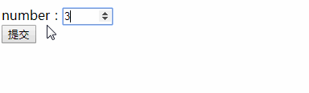

#### HTML5 输入类型

2022年4月1日18:37:06

----


HTML5 拥有多个新的表单输入类型。这些新特性提供了更好的输入控制和验证。

#### Input 类型 - email

`email` 类型用于应该包含 e-mail 地址的输入域。在提交表单时，会自动验证 email 域的值。

例子：

```html
<body>
  <form action="#" method="get">
    E-mail: <input type="email" name="user_email" /><br />
    <input type="submit" value="提交" />
  </form>
</body>
```

运行效果为：


#### Input 类型 - url

`url` 类型用于应该包含 URL 地址的输入域。在提交表单时，会自动验证 url 域的值。

例子：

```html
<body>
  <form action="#" method="get">
    Url: <input type="url" name="user_url" /><br />
    <input type="submit" value="提交" />
  </form>
</body>
```

运行效果为：


#### Input 类型 - number

`number` 类型用于应该包含数值的输入域。属性 `max` 设定允许输入的最大值，属性 `min` 设定允许输入的最小值，属性 `value` 设定默认值，属性 `step` 设定合法的数字间隔（比如 `step` 的值为 `2`，则合法的数字为 `-2`,`0`,`2`,`4` 等）。

例子：

```html
<body>
  <form action="#" method="get">
    number：<input
      type="number"
      name="points"
      min="0"
      max="10"
      step="2"
      value="2"
    /><br />
    <input type="submit" value="提交" />
  </form>
</body>
```

运行效果为：



#### Input 类型 - range

`range` 类型用于应该包含一定范围内数字值的输入域。`range` 类型显示为滑动条。同样的 `range` 也有 `max`，`min`，`value`，`step` 属性与上面所讲的 `number` 中的一致。

例子：

```html
<body>
  <form action="#" method="get">
    range:
    <input
      type="range"
      name="points"
      min="1"
      max="10"
      value="2"
      step="2"
    /><br />
    <input type="submit" value="提交" />
  </form>
</body>
```

运行效果为：


#### Input 类型 - Date Pickers（日期选择器）

HTML5 拥有多个可供选取日期和时间的新输入类型：

- date - 选取日、月、年
- month - 选取月、年
- week - 选取周和年
- time - 选取时间（小时和分钟）
- datetime - 选取时间、日、月、年（UTC 时间）**注意：此类型已被弃用，目前大多数浏览器都不再支持。**
- datetime-local - 选取时间、日、月、年（本地时间）

例子：

```html
<body>
  <form action="#" method="get">
    Date: <input type="date" name="user_date" /><br />
    <input type="submit" value="提交" />
    <br /><br />
    Month: <input type="month" name="user_month" /><br />
    <input type="submit" value="提交" />
  </form>
</body>
```

运行效果为：


#### Input 类型 - color

`color` 类型用于选择颜色。

例子：

```html
<body>
  <form action="#" method="get">
    <input type="color" name="colordemo" />
    <input type="submit" value="提交" />
  </form>
</body>
```

运行效果为：

