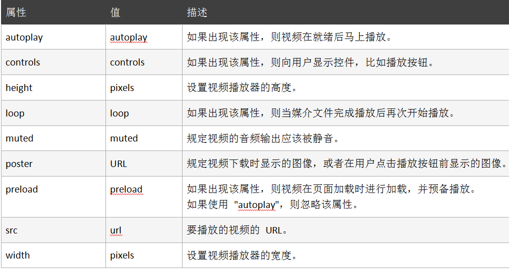
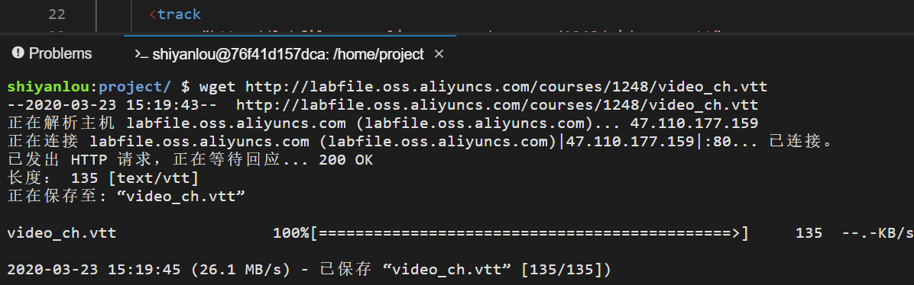
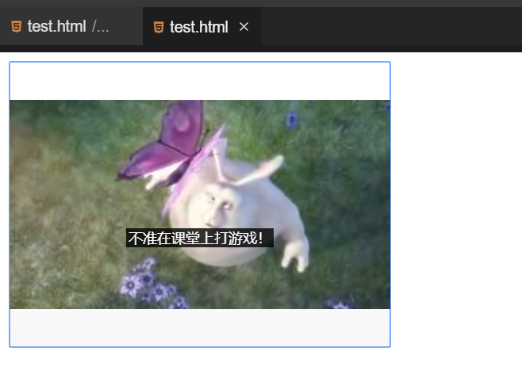

#### HTML5 视频介绍

2022年4月1日18:52:29

---

HTML5 规定了一种通过 video 元素来包含视频的标准方法。

视频格式和浏览器支持如下所示：

| 格式       | 浏览器                                   |
| ---------- | ---------------------------------------- |
| .ogg       | FireFox 3.5+ ，chrome 5.0+ ，Opera 10.5+ |
| .mp4/H.264 | Safari 3.0+ ，chrome 5.0+ ，IE 9.0+      |
| .webm      | FireFox 4.0+ ，chrome 6.0+ ，Opera10.6+  |

例子：

```html
<!DOCTYPE html>
<html>
  <head>
    <meta charset="utf-8" />
    <title></title>
  </head>
  <body>
    <video width="320" height="240" controls="controls">
      <source
        src="https://labfile.oss.aliyuncs.com/courses/1248/video.ogg"
        type="video/ogg"
      />
      <source
        src="https://labfile.oss.aliyuncs.com/courses/1248/video.mp4"
        type="video/mp4"
      />
      你的浏览器不支持video元素
    </video>
  </body>
</html>
```

注：`<video>` 与 `</video>` 之间插入的内容是供不支持 `video` 元素的浏览器显示的。`video` 元素允许多个 `source` 元素，`source` 元素可以链接不同的视频文件，浏览器将使用第一个可识别的格式。

引入单个文件也可以这样写：

```html
<body>
  <video
    src="https://labfile.oss.aliyuncs.com/courses/1248/video.ogg"
    width="320"
    height="240"
    controls="controls"
  >
    你的浏览器不支持video元素
  </video>
</body>
```

`video` 标签的属性如下所示：



这些属性设置都很简单，大家可以自行尝试体验一番。

#### 字幕的简单使用

使用常用的 WebVtt 字幕格式，在 `<video>` 中使用 `<track>` 元素引入字幕。例如：

```html
<track
  src="https://labfile.oss.aliyuncs.com/courses/1248/video_ch.vtt"
  srclang="zh"
  kind="subtitles"
  label="中文"
  default
/>
<track
  src="https://labfile.oss.aliyuncs.com/courses/1248/video_en.vtt"
  srclang="en"
  kind="subtitles"
  label="English"
/>
```

track 元素属性说明：

- src：指定资源 `url`。
- srclang：资源的语言，例如：中文 `zh`，英文 `en`。
- kind：默认值是 `subtitles` 字幕，`captions` 标题、音效及其他音频信息，`descriptions` 视频的文本描述，`chapters` 章节导航，`metadata` 元数据。
- label：选择字幕时候出现的文字。
- default：`default` 指的是默认会显示的字幕。例如两个 `<track>` 元素，如果都没有 `default` 属性，那都不显示，需要用户手动调出。另外，`default` 只能出现在一个 `<track>` 元素上。

例子：

首先我们在终端中分别输入以下命令，获取所需字幕文件：

```bash
wget https://labfile.oss.aliyuncs.com/courses/1248/video_ch.vtt
wget https://labfile.oss.aliyuncs.com/courses/1248/video_en.vtt
```



```html
<body>
  <video src="https://labfile.oss.aliyuncs.com/courses/1248/video.ogg"
    width="320"
    height="240"
    controls="controls"
  >
    你的浏览器不支持video元素
    <track
      src="video_ch.vtt"
      srclang="en"
      kind="subtitles"
      label="中文"
      default
    />
    <track src="video_en.vtt" srclang="en" kind="subtitles" label="English" />
  </video>
</body>
```

video_ch.vtt 中的内容为：

```html
WEBVTT 00:00:01.000 --> 00:00:04.000 不准在课堂上打游戏 00:00:05.000 -->
00:00:09.000 好好学习，天天向上！
```

video_en.vtt 中的内容为：

```html
WEBVTT 00:00:01.000 --> 00:00:04.000 Don't play games in class！ 00:00:05.000
--> 00:00:09.000 Study hard and make progress every day！
```

运行效果如下所示：



通过上面的案例，我们了解了简单的视频制作以及为视频添加字幕和切换字幕。


下一步