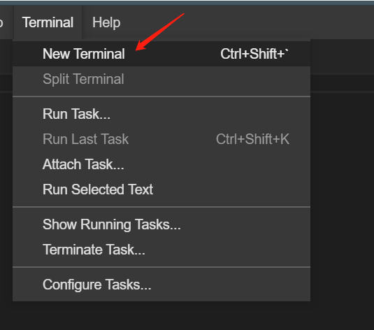

#### HTML5 拖放概述


拖放（Drag 和 drop）是 HTML5 标准的组成部分，任何元素都能够拖放，从字面意思上来理解，拖放就是抓取对象后拖到另一个位置上。

注：`img`元素和 `a` 元素（必须指定 `href`）默认允许拖放。

打开 Terminal 终端：



在 Terminal 中输入以下命令获取本节使用到的图片：

```bash
wget https://labfile.oss.aliyuncs.com/courses/1248/drag-image.png
```

> 图片的下载位置，请注意在后续 html 文件所在同目录下。

#### 浏览器支持

Internet Explorer 9、Firefox、Opera 12、Chrome 以及 Safari 5 支持拖放。

**注释：**在 Safari 5.1.2 中不支持拖放。