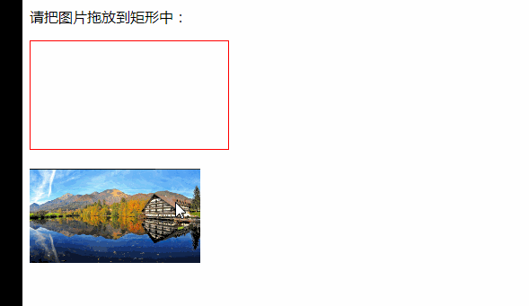

#### HTML5 拖放使用

2022年4月1日19:41:16

---


注意：之后的学习会涉及 JavaScript 的基础用法，如果有不明白的，可以到实验楼[JavaScript 基础教程](https://www.lanqiao.cn/courses/1238)进行学习。 先来看个例子：

```html
<!DOCTYPE html>
<html>
  <head>
    <meta charset="UTF-8" />
    <title></title>
    <style type="text/css">
      #div1 {
        width: 200px;
        height: 100px;
        padding: 10px;
        border: 1px solid red;
      }
    </style>
    <script type="text/javascript">
      function allowDrop(ev) {
        ev.preventDefault();
      }

      function drag(ev) {
        ev.dataTransfer.setData("Text", ev.target.id);
      }

      function drop(ev) {
        ev.preventDefault();
        var data = ev.dataTransfer.getData("Text");
        ev.target.appendChild(document.getElementById(data));
      }
    </script>
  </head>

  <body>
    <p>请把图片拖放到矩形中：</p>
    <div id="div1" ondrop="drop(event)" ondragover="allowDrop(event)"></div>
    <br />
    
  </body>
</html>
```

运行效果为：



下面将为大家一一介绍拖放是如何实现的。

#### 确定什么是可拖动的

为了使元素可拖放，首先把 `draggable` 属性设置为 `true`，再加上全局事件处理函数 `ondragstart`，如下所示：

```html

```

#### 定义拖动数据

每个 `drag event` 都有一个 `dataTransfer` 属性保保存事件的数据。这个属性（ `DataTransfer` 对象）也有管理拖动数据的方法。`setData()` 方法添加一个项目的拖拽数据，如下面的示例代码所示：

```js
function drag(ev) {
  ev.dataTransfer.setData("Text", ev.target.id);
}
```

在这个例子中数据类型是 `"Text"`，值是可拖动元素的 `id ("drag1")`。

#### 定义一个放置区

`ondragover` 事件规定在何处放置被拖动的数据。默认地，无法将数据/元素放置到其他元素中。如果需要设置允许放置，我们必须阻止对元素的默认处理方式,如下所示：

```js
function allowDrop(ev) {
  ev.preventDefault();
}
```

#### 进行放置

当放置被拖数据时，会发生 `drop` 事件。如下所示：

```js
function drop(ev) {
  //调用 preventDefault() 来避免浏览器对数据的默认处理
  ev.preventDefault();
  //通过 dataTransfer.getData("Text") 方法获得被拖的数据。该方法将返回在 setData() 方法中设置为相同类型的任何数据。
  var data = ev.dataTransfer.getData("Text");
  //被拖数据是被拖元素的 id ("drag1"),把被拖元素追加到放置元素（目标元素）中
  ev.target.appendChild(document.getElementById(data));
}
```

上面只是简单的讲解了一个图片拖放的案例，想要了解更多拖放的知识，请访问：[MDN HTML 拖放 API](https://developer.mozilla.org/zh-CN/docs/Web/API/HTML_Drag_and_Drop_API#接口)