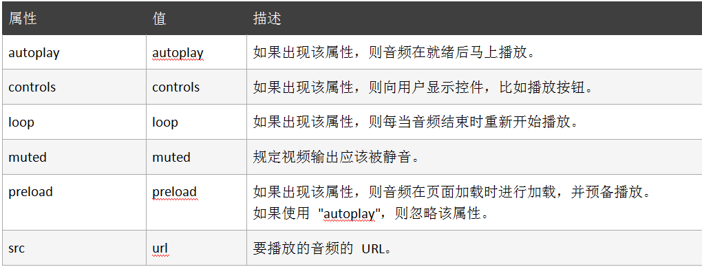

#### HTML5 音频介绍


HTML5 规定了一种通过 audio 元素来包含音频的标准方法。

音频格式和浏览器支持如下所示：

| 格式 | 浏览器                                 |
| ---- | -------------------------------------- |
| .ogg | FireFox 3.5+，chrome 3.0+，Opera 10.5+ |
| .mp3 | Safari 3.0+，chrome 3.0+，IE 9.0+      |
| .wav | FireFox 3.5+，Safari 3.0+，Opera10.5+  |

例子：

```html
<body>
  <audio controls="controls">
    <source
      src="https://labfile.oss.aliyuncs.com/courses/1248/video.ogg"
      type="audio/ogg"
    />
    <source
      src="https://labfile.oss.aliyuncs.com/courses/1248/phone.mp3"
      type="audio/mpeg"
    />
    你的浏览器不支持audio元素
  </audio>
</body>
```

注：`<audio>` 与 `</audio>` 之间插入的内容是供不支持 `audio` 元素的浏览器显示的。`audio` 元素允许多个 `source` 元素，`source` 元素可以链接不同的音频文件，浏览器将使用第一个可识别的格式。

引入单个文件也可以这样写：

```html
<body>
  <audio
    src="https://labfile.oss.aliyuncs.com/courses/1248/phone.mp3"
    controls="controls"
  >
    你的浏览器不支持video元素
  </audio>
</body>
```

`audio` 标签的属性如下所示：

